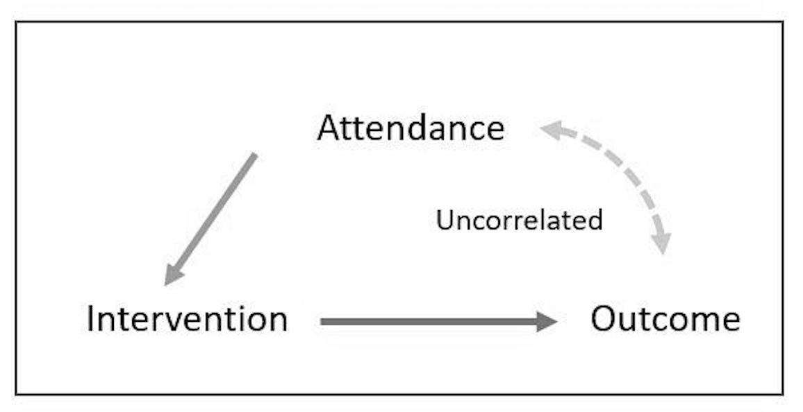
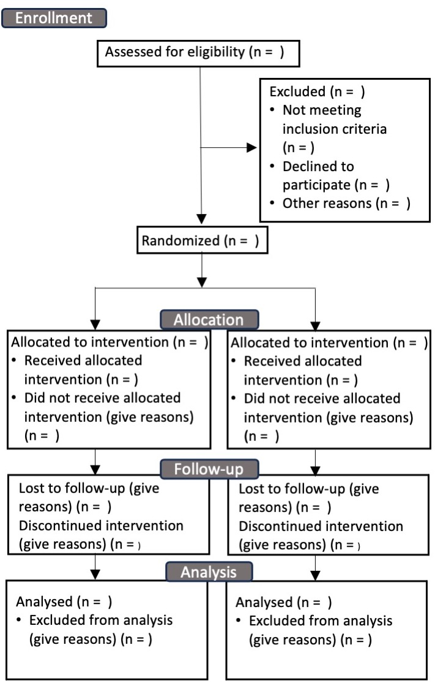

# Further potential for bias: volunteers, dropouts, and missing data {#dropouts}

```{r addlogo,echo=F,warning=F,message=F}
mylogo <- 0
if(mylogo==1){
knitr::include_graphics("images/logo_alone_new.png")
}
```

## Learning objectives
By the end of this chapter, you will be able to:

-   Distinguish potential sources of bias in who gets included in a study

-   Understand different approaches to handling missing data in an intervention study

## Who volunteers for research?

Many people who might benefit from interventions never take part in research evaluations. It has been noted that in psychological research, there is a bias for participants to be WEIRD, that is Western, educated, and from industrialized, rich, and democratic countries [@henrich2010]. We are not aware of specific studies on participants in speech and language intervention studies, but it is likely that similar biases operate. It is important to know about the demographics of participants, as this may affect the extent to which results will be generalizable to the population at large. Researchers should report on the distribution of socio-economic, educational and cultural background of those taking part in intervention studies.\index{socio-economic status}\index{cultural factors}

If the aim is to evaluate intervention targeted at disadvantaged groups, then it is important to think hard about how to optimize recruitment. Positive moves might include having a researcher or other intermediary who comes from a similar background to the target population, who will know the best ways to communicate and gain their confidence. Running a focus group may give insights into barriers to participation,\index{barriers to participation} which may be practical (finding time, or costs for transport or childcare) or social (feeling uncomfortable around people from a different social or ethnic background). Small things can make a big impact: we heard of one local community study with disadvantaged families that involved parent-training, which ended with parents being given a certificate on completing the training: the researchers said that this was appreciated by many parents, most of whom had never obtained any formal qualifications. Some of them went on to help recruit and train the next parent group.

The bottom line is that when planning to evaluate an intervention, it is important for researchers to think carefully about who the intervention is intended for. Once the target population is defined, then the aim should be to get as representative a sample as possible from that population. Involving the intended recipients of intervention in planning and running a study can both ensure that the intervention meets the needs of the community, and that they are motivated to take part (see @graham2016).\index{participant engagement}

## Dropouts after recruitment: Intention to treat analysis

<!---<p id="vignette">-->
\begin{shaded}
\textit{Marie is evaluating a phonological awareness training package with a group of "at risk" five-year-olds. She has adopted a randomized controlled design, with an active control group who get extra help with maths. She recruits 30 children to each group and runs the intervention for six weeks. However, two weeks in to the study, three children in the phonological awareness group and one from the control group drop out, and she learns that another child from the control group has been taken by his mother for intensive private speech and language therapy which includes phonological awareness training. Marie is left unsure what to do. Should she exclude these children from her study?}
\end{shaded}
<!---</p>-->

Every information sheet for an intervention study emphasizes that participants are free to drop out at any time, without giving a reason, with no adverse consequences. This is as it should be: it would not be ethical to coerce people to take part in research, and it would be foolish to try. Nevertheless, every researcher's heart sinks when this happens because it can really mess up a trial and make it harder to show an intervention effect.\index{dropouts}\index{missing data}\index{data!missing}

If Marie were to consult a trials methodologist, she might be surprised at the answer. She is likely to be advised that she should not exclude participants who drop out or start other interventions. If people have withdrawn from the study, then their data cannot be included, but if there are children who are willing to be seen for the outcome assessments, their data should be included, even if they did not do the intervention they were assigned as planned. This is known as an **intention-to-treat** analysis - i.e. you conduct the analysis with people divided into groups according to how you intended to categorise them, regardless of what they actually did.\index{intention-to-treat} At first glance, this seems crazy. We want to evaluate the intervention: surely we should not include people who don't get the full intervention! Even worse, the control group is supposed to contain people who didn't get the intervention -- if we include some who obtained it by other means, this reduces the chances of seeing an effect.

The problems posed by drop-outs may be illustrated with an extreme example. Suppose Bridget Jones volunteers for a study of a miracle cure for obesity that involves giving up regular food for six weeks and consuming only a special banana milkshake that provides 500 calories per day. The control group consists of people who want to lose weight but are just given written materials explaining the calorie content of food. At the end of the six weeks, only 5 of the 50 original milkshake group are sticking to the diet, but they have all lost impressive amounts of weight compared to the control group, whose weight has gone down marginally. Bridget, together with 90% of the intervention group, found the diet impossible to stick to, got so hungry that she binged on chocolate, and actually gained weight. Is it reasonable to conclude that the milkshake diet worked? It depends on what question you are asking. If the question is "does extreme calorie restriction lead to weight loss?" the answer would appear to be yes. But that's not really what the study set out to do. It was designed to ask whether this specific intervention was effective for the kind of people enrolled in the study. Clearly, it wasn't -- because most people found it impossible to stick to it - and it would be a bad idea to roll this out to larger samples of people.

In more realistic scenarios for allied health professionals, interventions are not likely to be so unacceptable to large numbers, but a key point is that drop-outs are seldom random. There are two opposite reasons why someone might give up on an intervention: they may just find it too hard to continue -- and this could be because of difficulties in finding the time as much as difficulties with the intervention itself -- or they might decide they are doing so well that they no longer need it. Either way, the group left behind after drop out is different from the one we started with.

It's instructive to look at the results from the little study by @bishop2006, who used computerized tasks to train comprehension in children (Chapter \@ref(prepost)). Teachers and teaching assistants did the exercises with the children, three of whom dropped out. When we looked at the data, we found that the drop-outs had particularly low comprehension scores at the baseline. It is likely that these children just found the exercises too hard and became dispirited and unwilling to continue. Importantly, they were not a random subset of children. If we had excluded them from the analysis, we would no longer be comparing randomized groups who had been comparable at baseline -- we would be comparing an intervention group that now omitted those with the worst problems with a control group that had no such omissions. This is known as a **per protocol** analysis,\index{per protocol} and it will overestimate the mean and underestimate the variance in the intervention effect and lead to biased results.

Nevertheless, if we only do an intention-to-treat analysis, then we lose an opportunity to learn more about the intervention. We would always complement it with an analysis of the drop-outs. Did they look different at baseline? Do we know why they dropped out? And what were their outcomes? For our comprehension study, this analysis gave a salutary message. The drop-outs showed substantial improvement on the outcome comprehension test, despite not having completed the intervention. This provides a clear example of how scores can change with practice on the test and regression to the mean (see Chapter \@ref(nonspecific)).

## Instrumental Variable analysis

A clever technique known as Instrumental Variable analysis\index{Instrumental Variable analysis} can be used to obtain a more accurate estimate of an intervention effect when there are dropouts and/or control cases who received intervention, provided we can assess their outcomes. In effect, we do the analysis comparing those who did and did not actually do the intervention, but we adjust scores to take into account which group they were assigned to. This involves a two-step regression procedure, the details of which are how beyond the scope of the current book, it is illustrated by @huang2018, who also gives a very clear explanation of the logic. The instrumental variable analysis gives a more accurate estimate of the intervention effect than the intention-to-treat analysis, without introducing the bias that occurs if we use a per protocol analysis.

```{r IVfig, echo=F,fig.cap = "Path diagram of the instrumental variable approach",out.width="60%"}

```


Suppose we have run a trial that tests a particular intervention, we might find that not everyone conformed to the intervention, perhaps not attending all sessions. We can include attendance as a instrumental variable and get an adjusted estimate of our intervention effect on that basis (Figure \@ref(fig:IVfig)). The important thing to keep in mind is that the instrumental variable is likely to be correlated with the intervention but not the outcome.

## Missing data

\index{missing data}People who drop out of trials are one source of missing data, but most trials will also have cases where just a subset of measures is missing. There are numerous reasons for this: an assessment session may have over-run, test materials may have been lost, a computer may have crashed at a key moment, a researcher may have forgotten to record a result, or a participant may have been too tired, unwell, impatient or anxious to continue. In the past, it was common for people to just drop missing data, but, just as with participant dropouts, this can create bias. In addition, some statistical methods require complete data for all participants, and it seems wasteful to drop a case when only part of the data is absent. Statisticians have devised a range of methods for handling missing data, typically using a method known as **imputation**,\index{imputation} where missing data points are estimated from the existing data [@rioux2021]. How this is done depends on the underlying reason for what statisticians term "missingness". The easiest case to deal with is when it is completely random whether data are missing or not. The examples above where the missingness is caused by the researcher or equipment - a crashed computer, forgotten recording, or suchlike - might feasibly be regarded as random. But where the missingness is down to something about the participant - for instance, refusal or inability to co-operate with an assessment - this is not random. And other situations may also be affected by the participant, even when this is less obvious. So if the session was not completed in available time, was this because the participant was slow to respond or distractible, or was it because of an external cause, such as a fire alarm?\
Imputation typically involves estimating a predicted score from the available data. For instance, in the full dataset, an outcome measure may be predicted from baseline scores, age and socio-economic status. We can use this information to create predicted outcomes for those who have missing data. This method, however, can create problems, because it gives the "best" estimate of the missing data, and will underestimate the variability of outcome scores. As explained by @vanbuuren2018, it is preferable to use an approach called **multiple imputation**,\index{imputation!multiple} where several imputed datasets are created, each incorporating some random noise in the prediction. Statistical analysis is run for each imputed dataset, and the results are then pooled to give a final estimate of the intervention effect. Figure \@ref(fig:micefig) (based on image from [this website](https://data.library.virginia.edu/getting-started-with-multiple-imputation-in-r/)) shows the stages of processing. This approach is computationally demanding, especially for large datasets, but is a way of ensuring all the available data is used in an analysis, while minimizing bias. With modern computers it is tractable, and computer packages exist to handle the technical details.

\begin{center}
```{r micefig, echo=F,fig.cap = "Schematic stages of multiple imputation: here 3 versions of the original dataset are generated with missing values imputed; the analysis is repeated for each version, and then the analysis results are pooled to give a single estimate of intervention effect",out.width="75%"}
knitr::include_graphics("images_bw/mice_fig.jpg")
```
\end{center}

What about the case where the missing data is not random? Then one really needs to think through the logic of each individual situation. For instance, suppose we have an assessment such as The Test of Word Reading Efficiency [@torgesen1999], where a pretest is used to familiarise the child with the task and check if they can read very simple words or nonwords. If the child can't read any items in the pretest, then the assessment is terminated. There is no standard score, but in this case, it is reasonable to assign a score at the test floor. Consider another case where children from one classroom have missing data on a reading assessment because the teacher did not wish to test the children. In such a case, the best option may be to use imputation, based on data from other assessments.

A useful overview of methods for handling missing data is provided by [this website](https://www.missingdata.nl/) by Iris Eekhout.

## Check your understanding

1.  A study by @imhof2023 evaluated a video-coaching intervention with parents of children involved in a Head Start Program in the USA. Read the methods of the study and consider what measures were taken to encourage families to participate. How successful were they? What impact is there on the study of: (a) failure to recruit sufficient families into the study, (b) drop-out by those who had been enrolled in the intervention?

```{r consortfig, echo=F,fig.cap = "CONSORT Flow Diagram",out.width="90%"}

```

2.  A version of Figure \@ref(fig:consortfig) can be downloaded from the [CONSORT website](http://www.consort-statement.org/consort-statement/flow-diagram). Use of this flow chart has become standard in medical trials, because it helps clarify the issues covered in this chapter.

Find an intervention study in the published literature which does not include a flow diagram, and see how much of the information in the flow chart can be completed by reading the Methods section. (The Imhof et al study can also be used for this exercise).
