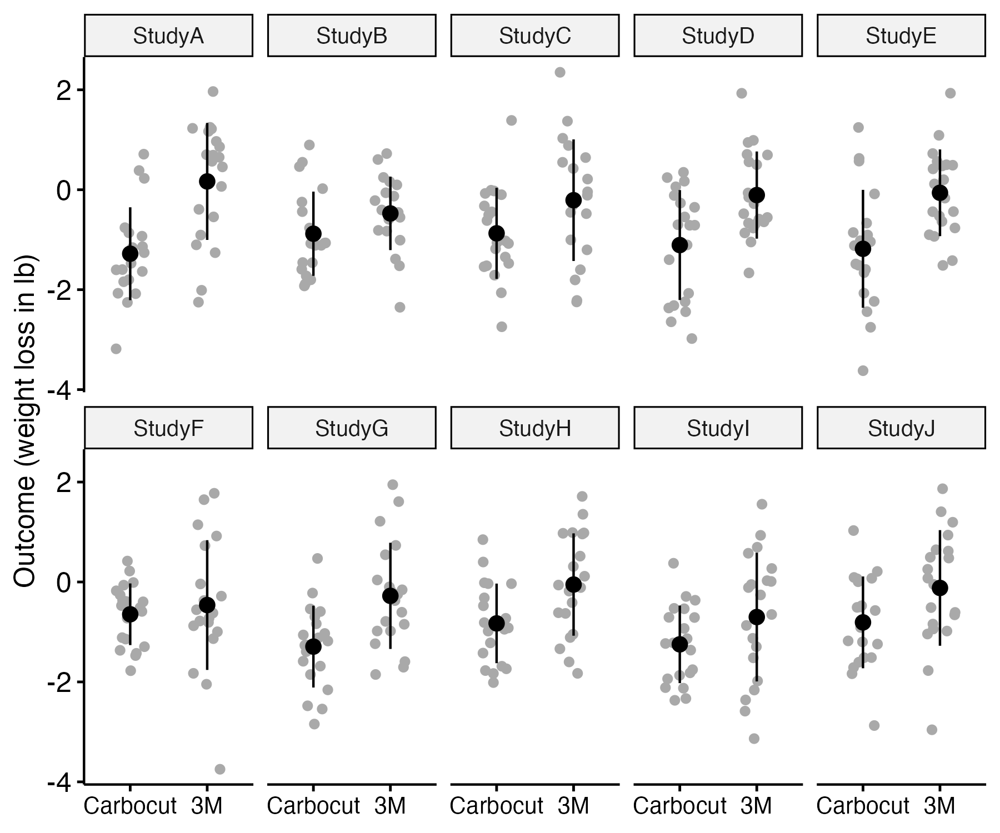
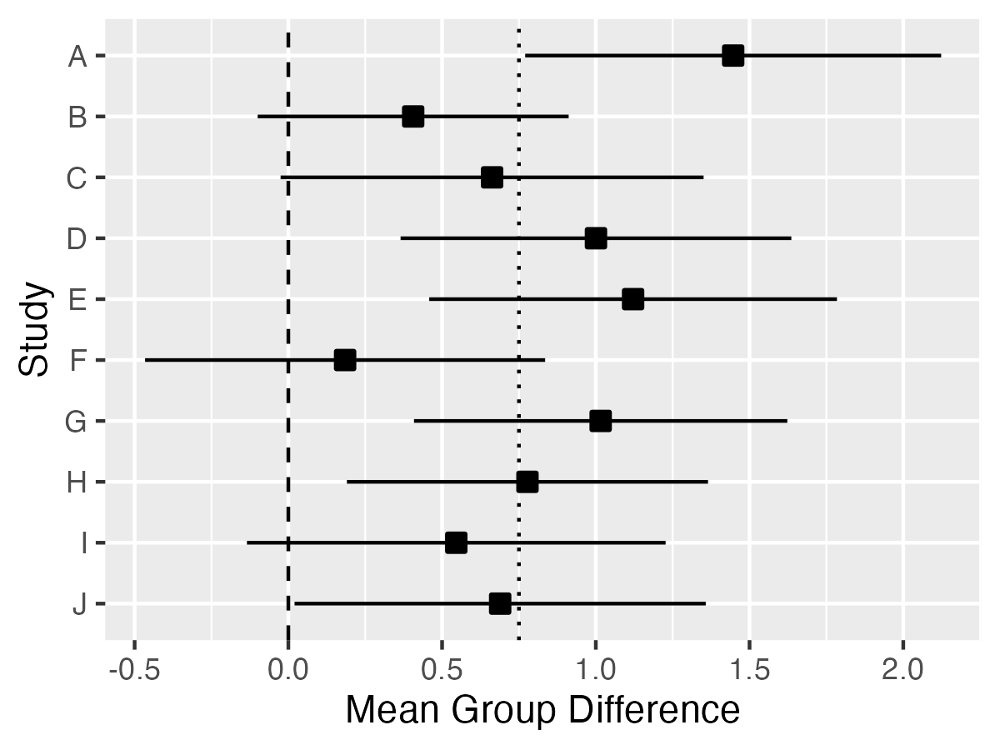

# Analyzing a two-group RCT {#analysis}

```{r,echo=F,warning=F,message=F}
require(psych) #for describeBy
library(rstatix) #for ancova
library(yarrr) # for pirate plots (see below)
library(nlme)
library(lme4)
library(ggpubr)
library(kableExtra)
library(beeswarm)
require(MASS) #simulating multivariate data
```

`r knitr::include_graphics("images/logo_alone_new.png")`

**Learning objectives**: By the end of this chapter, you will be able to:

-   Appreciate why we need to measure variation as well as average effects of an intervention  
-   Understand the terms "standard deviation", "confidence interval" and "p-value"  
-   Interpret output from a t-test
-   Explain why Analysis of Covariance is often recommended to analyse outcome data 

## Planning the analysis

Statisticians often complain that researchers will come along with a set of data and ask for advice as to how to analyse it. Sir Ronald Fisher (one of the most famous statisticians of all time) commented:

> "To consult the statistician after an experiment is finished is often merely to ask him to conduct a post mortem examination. He can perhaps say what the experiment died of."

-Sir Ronald Fisher, Presidential Address to the First Indian Statistical Congress, 1938.

His point was that very often the statistician would have advised doing something different in the first place, had they been consulted at the outset. Once the data are collected, it may be too late to rescue the study from a fatal flaw.

Many of those who train as allied health professionals get rather limited statistical training. We suspect it is not common for them to have ready access to expert advice from a statistician. We have, therefore, a dilemma: many of those who have to administer interventions have not been given the statistical training that is needed to evaluate their effectiveness.

We do not propose to try to turn readers of this book into expert statisticians, but we hope to instill a basic understanding of some key principles that will make it easier to read and interpret the research literature, and to have fruitful discussions with a statistician if you are planning a study.

## The importance of variability

When we are considering the impact of an intervention, we tend to focus on means: in particular on the difference in average outcomes between an intervention group and a control group. But what we are really interested in is variability - specificially, how much of the variability in people's outcomes can be attributed to the intervention, and how much can be regarded as random noise. The widely-used method of **analysis of variance** gives us exactly that information, by looking at the total variability in outcomes, and considering what proportion is accounted for by the intervention.

\
To make this more concrete, consider the following scenario: You want to evaluate a weight loss program, Carbocut, which restricts carbohydrates. You compare 20 people on the Carbocut diet for 2 weeks with a control group where people are just told to stick to three meals a day (Program 3M). You find that those on Carbocut have lost an average of 1 lb more weight than those on 3M. Does that mean the diet worked? It's hard to say just from the information provided: some people may think that the average loss is unimpressive; others may think that it is encouraging, especially over such a short time scale. These answers are about **real-life significance** of this amount of weight loss. But they disregard another issue: the **statistical significance** of the weight loss. That has nothing to do with meaningfulness in the real world, and everything to do with **reproducibility** of the result. And this relates to the variability of outcomes within each group.

### Standard deviation  
Consider Figure \@ref(fig:demo-variation), which shows three different fictional studies. They have the same sample size in each group, 20. The mean difference in lbs of weight loss between the two diets (represented by the difference in the black horizontal lines) is similar in each case, but the variation within each group (the spread of points around the line) is greatest in scenario A, and least in scenario C. The intervention effect is far less impressive in scenario A, where 7/20 people in the Carbocut group score above the mean level of the 3M group, than in group C, where only 2/20 score above the 3M mean.
```{r demo-variation,echo=F,include=T,message=F,warning=F,fig.cap='Simulated data from three studies comparing two diets. Overlap between groups varies across.',out.width='150%'}
makefig <- 1 # we preserve code to make figure for just historical reasons. NB this did not use ggplot and so can't use ggsave. Uses base R to make figure.
#This saves figure as pdf. Can open in preview, crop and save as png at high resolution.
                                                                                                if(makefig==0)   {                                                                                         
knitr::include_graphics("images_bw/demo_variation.pdf")
                                                                                                }
if(makefig==1){
set.seed(9)

#to ensure same values generated on each run - change to any other number for different results. NB This seed deliberately selected to give demo data where the mean diff is similar across A B and C, and the SD reduces across A-C. Because small N, results can be quite variable across samples.

#create a set of values to simulate for true group differences in SD units
truediff<-c(.1,.75,1.25) #here we have 3 values; c stands for cocatenate so we get 3 values
#in a vector; we can refer to them as truediff[1], truediff[2] and truediff[3]
truelabel<-c('A','B','C') #to label the plots for each run

ndiffs<-length(truediff)
pdf("images_bw/demo-variation.pdf", width = 6, height = 2.5)
par(mfrow=c(1,3))

myn<-20 #N per group
myES <- NA
myavgSD <- NA
mymeandiff <-NA

mymeansdtab <- data.frame(matrix(NA,nrow=3,ncol=7))
colnames(mymeansdtab)<- c('Study','wtloss_mean_Carb','wtloss_SD_Carb','wtloss_mean_3M','wtloss_SD_3M','meandiff','ES')

for (i in 1:3){
  thisdiff<-truediff[i]

mynum <- rnorm(myn*2)
mynum[1:myn]<-mynum[1:myn]-thisdiff  #add truediff value to group 1 scores

#scale so that variances differ rather than means
mynum<-(-2)*mynum/(i)-2 #just divide by 1, 2 or 3, after switching polarity and multiplying by 2 (to make it more compatible with the example)

mygp<-c(rep(2,myn),rep(1,myn))#generate group IDs for equal sized groups 1 and 2
mydat<-data.frame(cbind(mygp,mynum)) #stick it all together in a dataframe
#mydat #uncomment this to look at the dataframe if you like

mymeansdtab$wtloss_mean_Carb[i]<-mean(mydat$mynum[1:20])
mymeansdtab$wtloss_SD_Carb[i] <- sd(mydat$mynum[1:20])
mymeansdtab$wtloss_mean_3M[i]<-mean(mydat$mynum[21:40])
mymeansdtab$wtloss_SD_3M[i] <- sd(mydat$mynum[21:40])
mymeansdtab$meandiff[i]<-mean(mydat$mynum[1:20])-mean(mydat$mynum[21:40])
mymeansdtab$ES[i]<-(mean(mydat$mynum[21:40])-mean(mydat$mynum[1:20]))/mean(sd(mydat$mynum[1:20]),sd(mydat$mynum[21:40]))
mymeansdtab$Study[i]<- truelabel[i]

if(makefig==1){
#Show the plot with the stats
myylab<-''
if (i==1){myylab<-'Weight change'}
mydat$mygp<-as.factor(mydat$mygp)
levels(mydat$mygp)<-c('Carbocut','3M')

beeswarm(mynum~mygp , data = mydat,xlab=truelabel[i],ylab=myylab,
         col='darkgrey',pch=16,ylim=c(-5,2),cex.axis=1.5,cex.lab=1.5)
segments(x0 = 0.7, x1 = 1.3,
         y0 = mean(mydat$mynum[21:40]), 
         lty = 1, lwd = 2,col='black')
segments(x0 = 1.7, x1 = 2.3,
         y0 = mean(mydat$mynum[1:20]), 
         lty = 1, lwd = 2,col='black')

  }
}
dev.off()
}

```

 

The spread in scores within each group is typically measured by the **standard deviation**, which is a mathematical way of representing how tightly bunched a set of scores is around the mean. If we want to know how solid a result is, in terms of how likely it would be to reproduce in a new study, we need to consider not just the mean, but also the standard deviation of the intervention effect. [This website](https://www.mathsisfun.com/data/standard-deviation.html) explains how the standard deviation is computed, but in general, we can rely on statistics programs to do the calculations for us.

Why does the standard deviation matter? This is because, as noted above, the *statistical significance* of a finding, which indexes how likely a finding is to be reproducible in future studies, considers all the variation in scores, and looks at variation between groups *relative to the variation within each group*.

### Confidence intervals

We can use the standard deviation to get an index reflecting the precision of our estimate of the group difference. Suppose we were to run ten identical studies comparing the two diets, keeping the sample size the same each time. Figure \@ref(fig:demo-variation2) shows some simulated data of this scenario. In each case, the data were drawn by sampling from a population where the mean weight loss for Carbocut was 1 lb, and the mean loss for 3M was 0.25 lb. In both groups, the standard deviation was set to one. You may be surprised to see that the difference in means of the two groups fluctuates quite markedly, being substantial in study A, and negligible in study F, with other studies intermediate. The same computer code was used to generate the three plots: the different results are just random fluctuations due to chance, which will occur when you use random number generators in simulations. This relates to the topic of **sampling**, which we will cover in Chapter \@ref(power). The main take-home message is that when we run a study and get a mean difference between groups, this is an **estimate** of the true effect, which will contain some random noise.

```{r demo-variation2,echo=F,include=T,message=F,warning=F,fig.cap='Simulated data from ten studies comparing two diets. The observed mean is shown as a black point, and the SD as the black fins',out.width="80%"}

makefig <- 0 # we preserve code to make figure for just historical reasons. 

if(makefig==0){
  
}

set.seed(5) #to ensure same values generated on each run - change to any other number for different results

#create a set of values to simulate for true group differences in SD units
ni = 10
N = 20 #N per group

truediff<-rep(.75,ni) #here we use the same value, .75, for each run, in a vector

truelabel<-paste0('Study ',1:ni) #to label the plots for each run

#we'll just simulate data for ni studies in a long dataframe with 3 variables - study, group and outcome
df2 <-data.frame(matrix(ncol=3,nrow=ni*N*2))
colnames(df2)<- c('Study','Group','Outcome')

mymean=-.25 #avg loss in group 3M
mySD=1
ES = .75

df2$Study <- paste0('Study',rep(LETTERS[1:10],each=(N*2)))
df2$Group <- rep(c('Carbocut','3M'),each=N)
df2$Outcome <-rnorm(ni*N*2,mymean,mySD)
df2$Outcome[df2$Group=='Carbocut']<-df2$Outcome[df2$Group=='Carbocut']-ES #wt loss so we subtract
if(makefig==1){
dplot <- ggerrorplot(df2, x = "Group", y = "Outcome", 
            desc_stat = "mean_sd", color = "black",
            add = "jitter", add.params = list(color = "darkgray"))
dplot <- dplot+theme(axis.title.x=element_blank())+
 theme(axis.text.x=element_text(size=10))+
  scale_y_continuous(name='Outcome (weight loss in lb)')
bigd <- dplot+facet_wrap(~Study,ncol=5)

ggsave('images_bw/carbo10gp.png',bigd,scale = 1, width = 6, height = 5, units = c("in"), dpi = 300)
}

#compute mean difference and confidence intervals for each study
studydf <- data.frame(matrix(nrow=ni,ncol=10))
colnames(studydf)<- c('Study','Mean1','SD1','Mean2','SD2','Diff','Low95CI','High95CI','t','p')
for (i in 1:ni){
  studydf$Study[i]<-LETTERS[i]
  thisdf<-filter(df2,Study==paste0('Study',LETTERS[i]))
  studydf$Mean1[i]<-mean(thisdf$Outcome[thisdf$Group=='Carbocut'])
  studydf$SD1[i]<-sd(thisdf$Outcome[thisdf$Group=='Carbocut'])
  studydf$Mean2[i]<-mean(thisdf$Outcome[thisdf$Group=='3M'])
  studydf$SD2[i]<-sd(thisdf$Outcome[thisdf$Group=='3M'])
  studydf$Diff[i]<-studydf$Mean2[i]-studydf$Mean1[i]
  var1<-studydf$SD1[i]^2
  var2<-studydf$SD2[i]^2
  pooledvar <- (N-1)*(var1+var2)/(N+N-2)
  critval <- 2.0244 #tvalue for 2 tailed 95% ie qt(.025,38)
  studydf$Low95CI[i] <- studydf$Diff[i]-critval*sqrt((2*pooledvar/N))
  studydf$High95CI[i] <- studydf$Diff[i]+critval*sqrt((2*pooledvar/N))
  myt<-t.test(thisdf$Outcome ~ thisdf$Group)
  studydf$t[i]<-myt$statistic
  studydf$p[i]<-myt$p.value
}
     
```

When we report results from a study, we can report a **confidence interval** (CI) around the estimated mean difference between groups, which gives an indication of the uncertainty associated with the estimate; this will depend on the standard deviation and the sample size, both of which feature in its calculation. Figure \@ref(fig:ciplot) shows the mean group differences with 95% confidence intervals for the 10 studies from Figure \@ref(fig:demo-variation2). Because these data were simulated, we know that the true mean difference is 0.75, shown as a dotted vertical line, and can see that the mean estimates from the ten studies generally cluster around that value, but with a fair bit of variation. As we shall see in Chapter \@ref(power), high variation characterises studies with small sample sizes: the confidence intervals would be much smaller if we had 200 participants per group rather than 20. The dashed vertical line denotes zero. If the confidence interval includes zero, the study will fail to reach statistical significance on a t-test, which is a method of analysis that we will explain in later in this chapter. We can see that studies B, C, F and I would all be non-significant on this criterion. We will discuss in Chapter \@ref(power) how it is that we can get nonsignificant results even if there is a true group difference - and how to avoid this situation.

```{r ciplot,echo=F,include=T,message=F,warning=F,fig.cap='Mean difference (black square) with 95% Confidence Intervals (fins) for 10 studies from previous Figure. Dashed line shows zero; dotted line shows true population difference',out.width="75%"}
makefig <- 0 # we preserve code to make figure for just historical reasons. NB this did not use ggplot and so can't use ggsave. Uses base R to make figure.

if(makefig==0){
  
}

if(makefig==1){
studydf$Study<-factor(studydf$Study,levels=c('J','I','H','G','F','E','D','C','B','A')) #need to reverse order so plot goes from A at top to J at bottom

myciplot <- ggplot(studydf,aes(x=Diff,y=Study,xmin=Low95CI,xmax=High95CI))+
  geom_pointrange(shape=22,fill='black')+
  geom_vline(xintercept=.75,linetype='dotted')+
   geom_vline(xintercept=0,linetype='dashed')+
  xlab('Mean Group Difference')
  
ggsave('images_bw/carbo10CI.png',myciplot,scale = 1, width = 4, height = 3, units = c("in"), dpi = 300)
}
```

#### Reporting of confidence intervals {.unnumbered}

::: {#custom}
Those who set standards for reporting clinical trial results generally encourage researchers to include confidence intervals as well as means. Reporting of confidence intervals is useful, not least because it encourages researchers and readers of research to appreciate that the results obtained from a study are just estimates of the true effect, and there may be a wide margin of uncertainty around results from small samples.  Some have pushed back against reporting of confidence intervals, either because of conceptual objections and/or because the confidence interval is widely misunderstood. The correct interpretation of a 95% confidence interval is that if you conducted your study over and over again, on 95% of occasions the confidence interval that you get will contain the true population mean. Illustrating this point, in Figure \@ref(fig:ciplot), you can see that for most studies, the confidence interval contains the true value, .75, but there is one study, study A, where there is a very large difference between means and the confidence interval does not include the true value. 
:::

## Understanding p-values

When we do an intervention study, we want to find out whether a given intervention works. Most studies use an approach known as **Null Hypothesis Significance Testing**, which gives us a rather roundabout answer to the question. Typically, findings are evaluated in terms of p-values, which tell us *what is the probability (p) that our result, or a more extreme one, could have arisen if there is no real effect of the intervention* - or in statistical jargon, if the **null hypothesis** is true. Suppose in a hypothetical world we have a totally ineffective drug, and we do 100 studies in large samples to see if it works. On average, in five of those studies (i.e. 5 per cent of them), the p-value would be below .05. And in one study (1 per cent), it would be below .01. The way that p-values are calculated assumes certain things hold true about the nature of the data ("model assumptions"): we will say more about this later on.

P-values are very often misunderstood, and there are plenty of instances of wrong definitions being given even in textbooks. The p-value is *the probability of the observed data or more extreme data, if the null hypothesis is true*. It does *not* tell us the probability of the null hypothesis being true. And it tells us nothing about the plausibility of the alternative hypothesis, i.e., that the intervention works.

An analogy might help here. Suppose you are a jet-setting traveller and you wake up one morning confused about where you are. You wonder if you are in Rio de Janiero - think of that as the null hypothesis. You look out of the window and it is snowing. You decide that it is very unlikely that you are in Rio. You reject the null hypothesis. But it's not clear where you are. Of course, if you knew for sure that you were either in Reykjavík or Rio, then you could be pretty sure you were in Reykjavík. But suppose it was *not* snowing. This would not leave you much the wiser.

A mistake often made when interpreting p-values is that people think it tells us something about the probability of a hypothesis being true. That is not the case. There are alternative Bayesian methods that can be used to judge the relatively likelihood of one hypothesis versus another, given some data, but they do not involve p-values.

A low p-value allows us to reject the null hypothesis with a certain degree of confidence, but this does no more than indicate "something is probably going on here - it's not just random" - or, in the analogy above, "I'm probably not in Rio".

#### Criticisms of the use of p-values {.unnumbered}

<div>

There are many criticisms of the use of p-values in science, and a good case can be made for using alternative approaches, notably methods based on Bayes theorem. Our focus here is on Null Hypothesis Significance Testing in part because such a high proportion of studies in the literature use this approach, and it is important to understand p-values in order to evaluate the literature. It has also been argued that p-values are useful provided people understand what they really mean [@lakens2021].

One reason why many people object to the use of p-values is that they are typically used to make a binary decision: we either accept or reject the null hypothesis, depending on whether the p-value is less than a certain value. In practice, evidence is graded, and it can be more meaningful to express results in terms of the amount of confidence in alternative interpretations, rather than as a single accept/reject cutoff [@quintana2018].

</div>

In practice, p-values are typically used to divide results into "statistically significant" or "non-significant", depending on whether the p-value is low enough to reject the null hypothesis. We do not defend this practice, which can lead to an all-consuming focus on whether p-values are above or below a cutoff, rather than considering effect sizes and strength of evidence. However, it is important to appreciate how the cutoff approach leads to experimental results falling into 4 possible categories, as shown in Table \@ref(tab:confusionMat).

```{r confusionMat, echo=FALSE, message=FALSE, results='asis', warnings=FALSE}
options(kableExtra.html.bsTable = T)
mymat<-matrix(NA,nrow=2,ncol=3)

mymat[,1]<-c("Reject Null hypothesis","Do Not Reject Null Hypothesis")

mymat[,2]<-c("True Positive","False Negative \n (Type II error)")
mymat[,3]<-c("False Positive \n (Type I error)","True Negative")

mymat<-as.data.frame(mymat)
names(mymat)<-c("","Intervention effective","Intervention ineffective")

knitr::kable(mymat,escape = F, align = "c", booktabs = T, caption = 'Outcomes of hypothesis test') %>%
  kable_styling(c("striped", "bordered"), latex_options = "striped", full_width = F) %>%
  column_spec(1:1, bold = T) %>%
  column_spec(1:3,width = "9em") %>%
  add_header_above(c(" ","Ground truth" = 2))
```

The ground truth is the result that we would obtain if we were able to administer the intervention to the whole population - this is of course impossible, but we assume that there is some general truth that we are aiming to discover by running our study on a sample from the population. We can see that if the intervention really is effective, and the evidence leads us to reject the null hypothesis, we have a True Positive, and if the intervention is ineffective and we accept the null hypothesis, we have a True Negative. Our goal is to design our study so as to maximize the chances that our conclusion will be correct, but there two types of outcome that we can never avoid, but which we try to minimize, known as Type I and Type II errors. We will cover Type II errors in Chapter\@ref(power) and Type I in Chapter \@ref(phacking).

## What kind of analysis is appropriate?

The answer to the question "How should I analyse my data?" depends crucially on what hypothesis is being tested. In the case of an intervention trial, the hypothesis will usually be "did intervention X make a difference to outcome Y in people with condition Z?" There is, in this case, a clear null hypothesis -- that the intervention was ineffective, and the outcome of the intervention group would have been just the same if it had not been done. The null hypothesis significance testing approach answers just that question: it tells you how likely your data are if the the null hypothesis was true. To do that, you compare the distribution of outcome scores in the intervention group and the control group. And as emphasized earlier, we don't just look at the difference in mean outcomes between two groups, we consider whether that difference is greater than you'd expect given the variation *within* the two groups. (This is what the term "analysis of variance" refers to).

## Steps to take before data analysis

-   General sanity check on dataset - are values within expected range?
-   Check assumptions
-   Plot data to get sense of likely range of results

### Sample dataset with illustrative analysis

To illustrate data analysis, we will use a real dataset that can be retrieved from the [ESRC data archive](https://reshare.ukdataservice.ac.uk/852291/) [@burgoyne2016]. We will focus only on a small subset of the data, which comes from an intervention study in which teaching assistants administered an individual reading and language intervention to children with Down syndrome. A wait-list RCT design was used (see Chapter \@ref(crossover)), but we will focus here on just the first two phases, in which half the children were randomly assigned to intervention, and the remainder formed a control group. Several language and reading measures were included in the study, giving a total of 11 outcomes. Here we will illustrate the analysis with just one of the outcomes - letter-sound coding - which was administered at baseline (t1) and immediately after the intervention (t2). Results from the full study have been reported by @burgoyne2012 and are discussed in the demonstration of MEff by @bishop2023b. <!---this is the measure with the strongest effect - I considered using others but they are not great for illustrative purposes, as they aren't very normal! Script below written so that we could easily substitute one of the other measures if we wished (but then text would also need redoing in places)-->

```{r pirateRCT,echo=F,fig.cap='Data from RCT on language/reading intervention for Down syndrome by @burgoyne2012',warning=F,message=F}

makefig <- 1 # we preserve code to make figure for just historical reasons. NB this did not use ggplot and so can't use ggsave. Uses base R to make figure. Can open saved pdf in preview and crop and save as png

if(makefig==0){
  knitr::include_graphics("images_bw/pirateRCT.png")
}


dsdat <- read.csv("Data/dse-rli-trial-data-archive.csv")
dsdat <- dsdat[dsdat$included==1,]
dsdat$group <- as.factor(dsdat$group)

levels(dsdat$group)<-c("Intervention","Control")
dsdat$baseline <- dsdat$letter_sound_t1
dsdat$outcome <- dsdat$letter_sound_t2
dsdat$change<-dsdat$outcome-dsdat$baseline
if(makefig==1){
  pdf("images_bw/pirateRCT.pdf", width = 6, height = 5)
pirateplot(outcome~group,theme=1,cex.lab=1.3,data=dsdat, point.o=1, xlab="", ylab="Outcome score",pal="black")
}
#nb not part of ggplot
dev.off()
    
```

Figure \@ref(fig:pirateRCT) shows results on letter-sound coding after one group had received the intervention. This test had also been administered at baseline, but we will focus first just on the outcome results.

Raw data should always be inspected prior to any data analysis, in order to just check that the distribution of scores looks sensible. One hears of horror stories where, for instance, an error code of 999 got included in an analysis, distorting all the statistics. Or where an outcome score was entered as 10 rather than 100. Visualising the data is useful when checking whether the results are in the right numerical range for the particular outcome measure. The [pirate plot](https://www.psychologicalscience.org/observer/yarrr-the-pirates-guide-to-r) is a useful way of showing means and distributions as well as individual data points.

A related step is to check whether the distribution of the data meets the assumptions of the proposed statistical analysis. Many common statistical procedures assume that data are normally distributed on an interval scale (see Chapter \@ref(reliability)). Statistical approaches to checking of assumptions are beyond the scope of this book, but there are good sources of information on the web, such as [this website](http://www.sthda.com/english/articles/39-regression-model-diagnostics/161-linear-regression-assumptions-and-diagnostics-in-r-essentials/) for linear regression. But just eyeballing the data is useful, and can detect obvious cases of non-normality, cases of ceiling or floor effects, or "clumpy" data, where only certain values are possible. Data with these features may need special treatment and it is worth consulting a statistician if they apply to your data. For the data in Figure \@ref(fig:pirateRCT), although neither distribution has an classically normal distribution, we do not see major problems with ceiling or floor effects, and there is a reasonable spread of scores in both groups.\
<!-- maybe add a figure showing egs of nonnormal distribution, ceiling effect, clumpy data-->

```{r table2gp,echo=F,out.width="75%"}
options(kableExtra.html.bsTable = T)
mytab <- psych::describeBy(dsdat$outcome, group=dsdat$group,mat=TRUE,digits=3)
mytab <- mytab[,c(2,4:6)]
colnames(mytab)<-c('Group','N','Mean','SD')
mytab[1:2,1]<-c("Intervention","Control")
row.names(mytab)<-NULL
knitr::kable(mytab,escape = F, align = "c", booktabs = T,caption='Summary statistics on letter-sound coding outcomes after intervention') %>%
  kable_styling(c("striped", "bordered"), latex_options = "striped", full_width = F)

```

The next step is just to compute some basic statistics to get a feel for the effect size. Table \@ref(tab:table2gp) shows the mean and standard deviation on the outcome measure for each group. The mean is the average of the individual datapoints shown in Figure \@ref(fig:pirateRCT), obtained by just summing all scores and dividing by the number of cases. The standard deviation gives an indication of the spread of scores around the mean, and as we have seen, is a key statistic for measuring an intervention effect. In these results, one mean is higher than the other, but there is overlap between the groups. Statistical analysis gives us a way of quantifying how much confidence we can place in the group difference: in particular, how likely is it that there is no real impact of intervention and the observed results just reflect the play of chance. In this case we can see that the difference between means is around 6 points and the average SD is around 8.

### Simple t-test on outcome data

The simplest way of measuring the intervention effect is to just compare outcome (outcome) measures on a t-test. We can use a one-tailed test with confidence, given that we anticipate outcomes will be better after intervention. One-tailed tests are often treated with suspicion, because they can be used by researchers engaged in p-hacking (see Chapter \@ref(phacking)), but where we predict a directional effect, they are entirely appropriate and give greater power than a two-tailed test: see [this blogpost by Daniël Lakens](http://daniellakens.blogspot.com/2016/03/one-sided-tests-efficient-and-underused.html).\
When reporting the result of a t-test, researchers should always report all the statistics: the value of t, the degrees of freedom, the means and SDs, and the confidence interval around the mean difference, as well as the p-value. This not only helps readers understand the magnitude and reliability of the effect of interest: it also allows for the study to readily be incorporated in a meta-analysis. Results from a t-test for the data in Table \@ref(tab:table2gp) are shown in Table \@ref(tab:ttestoutcomes). Note that with a one-tailed test, the confidence interval on one side will extend to infinity: this is because a one-tailed test assumes that the true result is greater than a specified mean value, and disregards results that go in the opposite direction. <!-- not sure that is at all clear-->

```{r ttestoutcomes,echo=F,warning=F,message=F}
options(kableExtra.html.bsTable = T)
myt1 <- t.test(dsdat$outcome~dsdat$group,var.equal=T,alternative='greater')

mytabt <- c(round(myt1$statistic,3),round(myt1$parameter,0), round(myt1$p.value,3),round(myt1$estimate[1]-myt1$estimate[2],3),round(myt1$conf.int,3))
mytabt <- as.matrix(mytabt,ncol=6)
mytabt <- as.data.frame(t(mytabt))
colnames(mytabt)<-c('t','df','p','mean diff.','lowerCI','upperCI')
row.names(mytabt)<-NULL
knitr::kable(mytabt,escape = F, align = "c", booktabs = T,caption='T-test on outcomes') %>%
  kable_styling(c("striped", "bordered"), latex_options = "striped", full_width = F)
```

### T-test on difference scores

The t-test on outcomes is easy to do, but it misses an opportunity to control for one unwanted source of variation, namely individual differences in the initial level of the language measure. For this reason, researchers often prefer to take difference scores: the difference between outcome and baseline measures, and apply a t-test to these. In fact, that is what we did in the fictional examples of dietary intervention above: we reported *weight loss* rather than weight for each group before and after intervention. That seems sensible, as it means we can ignore individual differences in initial weights in the analysis.\
While this had some advantages over reliance on raw outcome measures, it also has disadvantages, because the amount of change that is possible from baseline to outcome is not the same for everyone. A child with a very low score at baseline has more "room for improvement" than one who has an average score. For this reason, analysis of difference scores is not generally recommended.

### Analysis of covariance on outcome scores

Rather than taking difference scores, it is preferable to analyse differences in outcome measures after making a statistical adjustment that takes into account the initial baseline scores, using a method known as analysis of covariance or ANCOVA. In practice, this method usually gives results that are similar to those you would obtain from an analysis of difference scores, but the precision is greater, making it easier to detect a true effect. However, the data do need to meet certain assumptions of the method. This [website](https://www.datanovia.com/en/lessons/ancova-in-r/) walks through the steps for performing an ANCOVA in R, starting with a plot to check that there is a linear relationship between pretest vs posttest scores in both groups - i.e. the points cluster around a straight line, as shown in Figure \@ref(fig:ds-prepost).

```{r ds-prepost,echo=F,fig.cap='Baseline vs outcome scores in the Down syndrome data',warning=F,message=F}
makefig <- 0 # we preserve code to make figure for just historical reasons. NB this did not use ggplot and so can't use ggsave. Uses base R to make figure.

if(makefig==0){
  knitr::include_graphics("images_bw/ds_prepost.png")
}

if(makefig==1){
#plot to check linearity by eye
ggscatter(
  dsdat, x = "baseline", y = "outcome",
  color = "group", add = "reg.line"
  )+
    xlab("Baseline")+ylab("Outcome")+
  scale_colour_grey() + theme_bw()
  ggsave('images_bw/ds-prepost.png',scale = 1, width = 6, height = 4, units = c("in"), dpi = 300)
}
```

Inspection of the plot confirms that the relationship between pretest and outcome looks reasonably linear in both groups. Note that it also shows that there are rather more children with very low scores at pretest in the control group. This is just a chance finding - the kind of thing that can easily happen when you have relatively small numbers of children randomly assigned to groups.

```{r ancova-compare,echo=F,warning=F,message=F}
options(kableExtra.html.bsTable = T)
#https://www.datanovia.com/en/lessons/ancova-in-r/

## I've omitted checks from this website for now, as I think this is too much detail. We want focus on how ancova gives different results from simple t-test because it adjusts for baseline scores. 

# order of variables matters when computing ANCOVA. You want to remove the effect of the covariate first - that is, you want to control for it - prior to entering your main variable or interest.
aov.1 <- dsdat %>% anova_test(outcome ~ group)
res.aov <- dsdat %>% anova_test(outcome ~ baseline +group)
# mylm1 <- lm(posttest~group,data=dsdat) #equivalent to aov.1
mylm <- lm(outcome~baseline+group,data=dsdat) #equivalent to res.aov
tab1 <- as.data.frame(get_anova_table(aov.1))
tab2 <- as.data.frame(get_anova_table(res.aov))
tab3 <- as.data.frame(summary(mylm)$coefficients)
source <-c('Intercept','baseline','Group')
tab3 <- cbind(source,tab3)
colnames(tab3)[5]<-'p'
tab1$p <- round(tab1$p,3)
tab2$p <- round(tab2$p,3)
tab3$p <- round(tab3$p,3)


tab1<-tab1[,-6]
tab2<-tab2[,-6]


knitr::kable(tab1,escape = F, align = "c", booktabs = T,caption='Analysis of outcome only (ANOVA)') %>%
  kable_styling(c("striped", "bordered"), latex_options = "striped", full_width = F) %>%
  column_spec(1, bold = T) 
```

```{r ancova,echo=F,warning=F,message=F}
knitr::kable(tab2,escape = F, align = "c", booktabs = T,caption='Outcome adjusted for pretest scores (ANCOVA)') %>%
  kable_styling(c("striped", "bordered"), latex_options = "striped", full_width = F)

#To get sensible output need to bolt tables together


#tab3 shows equivalent results from linear regression 


```

Table \@ref(tab:ancova_compare) shows the Down syndrome data analysed using ANOVA to compare only the outcome scores (upper chart), and Table \@ref(tab:ancova) shows the same data analysed using ANCOVA to adjust scores for the baseline values. The effect size is shown as ges, which stands for "generalized eta squared". You can see there is a large ges value, and correspondingly low p-value for the baseline term, reflecting the strong correlation between baseline and outcome shown in Figure \@ref(fig:ds-prepost). In effect, with ANCOVA, we adjust scores to remove the effect of the baseline on the outcome scores; in this case, we can then see a slightly stronger effect of the intervention: the effect size for the group term is higher and the p-value is lower than with the previous ANOVA.  

For readers who are not accustomed to interpreting statistical output, the main take-away message here is that you get a better estimate of the intervention effect if the analysis uses a statistical adjustment that takes into account the baseline scores.

#### T-tests, analysis of variance, and linear regression {.unnumbered}

<div>

Mathematically, the t-test is equivalent to two other methods: analysis of variance and linear regression. When we have just two groups, all of these methods achieve the same thing: they divide up the variance in the data into variance associated with group identity, and other (residual) variance, and provide a statistic that reflects the ratio between these two sources of variance. This is illustrated with the real data analysed in Table \@ref(tab:ancova-compare). The analysis gives results that are equivalent to the t-test in Table \@ref(tab:ttestoutcomes): if you square the t-value it is the same as the F-test. In this case, the p-value from the t-test is half the value of that in the ANOVA: this is because we specified a one-tailed test for the t-test. The p-value would be identical to that from ANOVA if a two-tailed t-test had been used.\
See [this blogpost](http://deevybee.blogspot.com/2017/11/anova-t-tests-and-regression-different.html) for more details. <!-- reminder to self: blogposts referenced in the book should be uploaded to figshare or another place with DOI-->

</div>

### Non-normal data

We've emphasised that the statistical methods reviewed so far assume that data will be reasonably normally distributed. This raises the question of what to do if we have results don't meet that assumption. There are two answers that are typically considered. The first is to use **non-parametric statistics**, which do not require normally-distributed data. For instance, the **Mann-Whitney U test** can be used in place of a t-test. An alternative approach is to **transform** the data to make it more normal. For instance, if the data is skewed with a long tail of extreme values, a log transform can be used. This is often appropriate if, for instance, measuring reaction times. Data may also be **censored** - extreme values converted to a ceiling level score to avoid outliers exerting undue effects on results. Many people are hesitant about transforming data - they may feel it is wrong to manipulate scores in this way. There are two answers to that. First, it does not make sense to be comfortable with nonparametric statistics and uncomfortable with data transformation, because nonparametric methods involve transformation - typically they work by rank ordering data, and then working with the ranks, rather than the original scores. Second, there is nothing inherently correct about measuring things on a linear scale: scientists often use log scales to measure quantities that span a wide range, such as the Richter scale for earthquakes or the decibel scale for sound volume. So, provided the transformation is justified as helping make the data more suited for statistical analysis, it is a reasonable thing to do. Of course, it is *not* appropriate to transform data just to try and nudge data into significance. Nor is it a good idea to just wade in an apply a data transformation without first looking at the data to try and understand causes of non-normality. For instance, if your results showed that 90% of people had no effect of intervention, and 10% had a huge effect, it might make more sense to consider a different approach to analysis altogether, rather than shoe-horning results into a more normal distribution. We will not go into details of nonparametric tests and transformations here, as there are plenty of good sources of information available. We recommend consulting a statistician if data seem unsuitable for standard parametric analysis. 

### Linear mixed models (LMM) approach

Increasingly, reports of RCTs are using more sophisticated and flexible methods of analysis that can, for instance, cope with datasets that have missing data, or where distributions of scores are non-normal. <!---With a linear mixed model (LMM), we can also take into account individual differences in response to intervention. These are very evident when we plot the baseline and posttest scores for individual participants (Figure \@fig(indsubs-plot)).-->

```{r indsubs-plot,echo=F,include=F,fig.cap = "Individual subjects' pretest and posttest scores",warning=F,message=F}
#trying to follow steps from:
#https://www.crumplab.com/psyc7709_2019/book/docs/a-tutorial-for-using-the-lme-function-from-the-nlme-package-.html
#put data in long format
vars1<-c('subject_id','group','baseline')
vars2<-c('subject_id','group','outcome')
half1<-dsdat[,vars1]
half2<-dsdat[,vars2]
colnames(half1)[3]<-'measurement'
colnames(half2)[3]<-'measurement'
long_all <- rbind(half1,half2)
long_all$time<-'Outcome'
long_all$time[1:nrow(dsdat)]<-'Baseline'
long_all$dummy<-1
long_all$dummy[1:nrow(dsdat)]<-0
colnames(long_all)[1]<-'ID'
long_all$ID<-as.factor(long_all$ID)

long_all$jittered <- jitter(long_all$measurement)
plot<- ggplot(long_all, aes(x=time, y=jittered,  color=group, group = ID), xlab(time) ) + 
  geom_point(size=.75)+
  geom_line(color="grey")+
    ylab("Score")+xlab("Session")
plot
#plot needs jitter because otherwise confusing because scores are in whole numbers so you get overlaid points - but even with jitter, not all that informative!.
```

```{r lmer-ds,echo=F,include=F,tab.cap='Output from Linear Mixed Model'}

mymodel <- lmer(measurement~time*group + (1|ID),  data = long_all)
sumbit <- anova(mymodel)

#null model
 nullmodel <- lmer(measurement~1 + (1|ID),  data = long_all)
# summary(nullmodel)

sumbit


```

An advantage of the LMM approach is that it can be extended in many ways to give appropriate estimates of intervention effects in more complex trial designs - some of which are covered in Chapter \@ref(adaptive) to Chapter \@ref(Single). Disadvantages of this approach are that it is easy to make mistakes in specifying the model for analysis if you lack statistical expertise, and the output is harder for non-specialists to understand. If you have a simple design, such as that illustrated in this chapter, with normally distributed data, a basic analysis of covariance is perfectly adequate [@oconnell2017].

<!--- Paul's help needed here?  I had assumed LMM would give more precise estimates, but the OConnell paper suggests ANCOVA is optimal-->

Table \@ref(tab:table-procon) summarises the pros and cons of different analytic approaches.

```{r table-procon, echo=F, include=T,out.width="75%"}
options(kableExtra.html.bsTable = T)
mytests <- c('t-test','ANOVA','Linear regression/ ANCOVA', 'LMM')
mytext1 <- c('Good power with 1-tailed test. \nSuboptimal control for baseline. \nAssumes normality.',
             'With two-groups, equivalent to t-test, \nbut two-tailed only. \nCan extend to more than two groups.',
             'Similar to ANOVA, but can adjust \noutcomes for covariates, \nincluding baseline.',
             'Flexible in cases with missing data, \nnon-normal distributions.')
mytext2 <- c('High','...','...','Low')
mytext3 <- c('Low','...','...','High')

mydf<-data.frame(cbind(mytests,mytext1,mytext2,mytext3))
colnames(mydf) <- c('Method','Features','Ease of understanding','Flexibility')
knitr::kable(mydf,escape = F, align = "c", booktabs = T,caption="Analytic methods for comparing outcomes in intervention vs control groups") %>%
  kable_styling(c("striped", "bordered"), latex_options = "striped", full_width = F)


```

## Check your understanding

1.  Figure \@ref(fig:boxploteg) shows data from a small intervention trial in the form of a boxplot. Check your understanding of the annotation in the top left of the plot. How can you interpret the p-value? What does the 95% CI refer to? Is the "mean.diff" value the same as shown in the plot?

```{r boxploteg,echo=F,message=F,fig.cap ='Sample data for t-test'}
# Data in two numeric vectors
# Modified from stdha example on ttest (on weight)
women_weight <- c(48.9, 61.2, 73.3, 81.8, 63.4, 64.6, 48.4, 48.8, 48.5)
men_weight <- c(67.8, 60, 63.4, 76, 89.4, 73.3, 67.3, 61.3, 62.4) 
# Create a data frame
my_data <- data.frame( 
                group = rep(c("Control", "Intervention"), each = 9),
                score = c(women_weight,  men_weight)
                )
myt <- t.test(women_weight, men_weight, var.equal = TRUE)
mylabel=paste0("t = ",round(-myt$statistic,2),"; p = ",round(myt$p.value,3),"; \nmean diff. = ",round((myt$estimate[2]-myt$estimate[1]),2),"; 95% CI  = ",round(-myt$conf.int[2],2)," to ", round(-myt$conf.int[1],2))
myg <- ggboxplot(my_data, x = "group", y = "score",
        ylab = "Score", xlab = "Groups")+
  annotate(geom="text",x=1.2, y=88, label=mylabel)


ggsave('images_bw/boxeg.png',myg,scale = 1, width = 6, height = 5, units = c("in"), dpi = 300)

```

2. Find an intervention study of interest and check which analysis method was used to estimate the intervention effect. Did the researchers provide enough information to give an idea of the effect size, or merely report p-values? Did the analysis method take into account baseline scores in an appropriate way?


