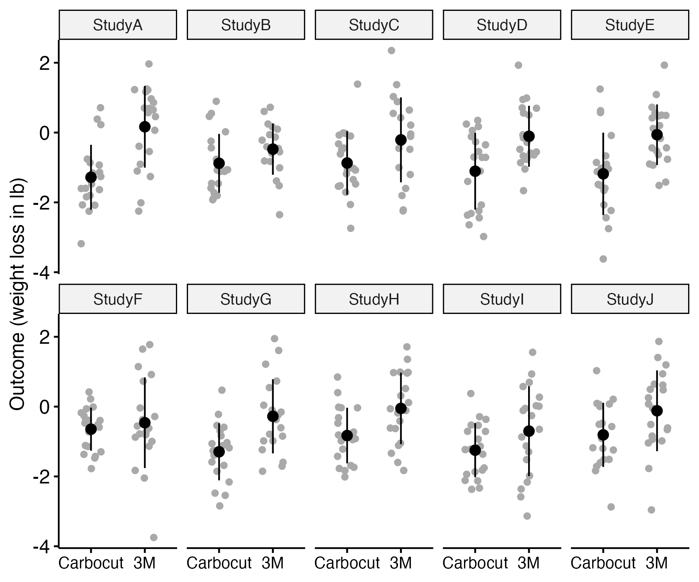

# The importance of variation {#variation}

```{r,echo=F,warning=F,message=F}
require(psych) #for describeBy
library(rstatix) #for ancova
library(yarrr) # for pirate plots (see below)
library(nlme)
library(lme4)
library(ggpubr)
library(kableExtra)
library(beeswarm)
require(MASS) #simulating multivariate data
```

```{r addlogo,echo=F,warning=F,message=F}
mylogo <- 0
if(mylogo==1){
knitr::include_graphics("images/logo_alone_new.png")
}
```

## Learning objectives  
By the end of this chapter, you will be able to:

-   Appreciate why we need to measure variation as well as average effects of an intervention  
-   Understand the terms "standard deviation" and "confidence interval"

**A note of warning**: Chapter \@ref(variation) to Chapter \@ref(phacking) are the most challenging in the book, insofar as they introduce several statistical concepts that are frequently misunderstood. We have minimized the amount of mathematical material in these chapters, and provide brief verbal summaries of the main points. Readers without a statistical background may find it helpful to try some of the exercises with interactive websites recommended in Check Your Understanding sections to gain a more intuitive understanding of the concepts covered here.


## The importance of variability

\index{variance}When we are considering the impact of an intervention, we tend to focus on means: in particular on the difference in average outcomes between an intervention group and a control group. But what we are really interested in is variability - specificially, how much of the variability in people's outcomes can be attributed to the intervention, and how much can be regarded as random noise. The widely-used method of **analysis of variance**\index{analysis!analysis of variance} gives us exactly that information, by looking at the total variability in outcomes, and considering what proportion is accounted for by the intervention.  


To make this more concrete, consider the following scenario: You want to evaluate a weight loss program, Carbocut, which restricts carbohydrates. You compare 20 people on the Carbocut diet for 2 weeks with a control group where people are just told to stick to three meals a day (Program 3M). You find that those on Carbocut have lost an average of 1 lb more weight than those on 3M. Does that mean the diet worked? It's hard to say just from the information provided: some people may think that the average loss is unimpressive; others may think that it is encouraging, especially over such a short time scale. These answers are about **real-life significance**\index{significance!real life} of this amount of weight loss. But they disregard another issue: the **statistical significance**\index{significance!statistical} of the weight loss. That has nothing to do with meaningfulness in the real world, and everything to do with **reproducibility**\index{reproducibility} of the result. And this relates to the variability of outcomes within each group.  

### Standard deviation  
Consider Figure \@ref(fig:demo-variation), which shows three different fictional studies. They have the same sample size in each group, 20. The mean difference in lbs of weight loss between the two diets (represented by the difference in the black horizontal lines) is similar in each case, but the variation within each group (the spread of points around the line) is greatest in scenario A, and least in scenario C. The intervention effect is far less impressive in scenario A, where 7/20 people in the Carbocut group score above the mean level of the 3M group, than in group C, where only 2/20 score above the 3M mean.\index{standard deviation}
```{r demo-variation,echo=F,include=T,message=F,warning=F,fig.cap='Simulated data from three studies comparing two diets. Each dot is the weight change of an individual. The horizontal bars show the group mean.  Overlap between groups is greatest for study A and least for study C.',out.width='90%'}
makefig <- 0 # we preserve code to make figure for just historical reasons. NB this did not use ggplot and so can't use ggsave. Uses base R to make figure.
#This saves figure as pdf. Can open in preview, crop and save as png at high resolution.
                                                                                                if(makefig==0)   {                                                                                         

                                                                                                }
if(makefig==1){
set.seed(9)

#to ensure same values generated on each run - change to any other number for different results. NB This seed deliberately selected to give demo data where the mean diff is similar across A B and C, and the SD reduces across A-C. Because small N, results can be quite variable across samples.

#create a set of values to simulate for true group differences in SD units
truediff<-c(.1,.75,1.25) #here we have 3 values; c stands for cocatenate so we get 3 values
#in a vector; we can refer to them as truediff[1], truediff[2] and truediff[3]
truelabel<-c('A','B','C') #to label the plots for each run

ndiffs<-length(truediff)
pdf("images_bw/demo-variation.pdf", width = 6, height = 2.5)
par(mfrow=c(1,3))

myn<-20 #N per group
myES <- NA
myavgSD <- NA
mymeandiff <-NA

mymeansdtab <- data.frame(matrix(NA,nrow=3,ncol=7))
colnames(mymeansdtab)<- c('Study','wtloss_mean_Carb','wtloss_SD_Carb','wtloss_mean_3M','wtloss_SD_3M','meandiff','ES')

for (i in 1:3){
  thisdiff<-truediff[i]

mynum <- rnorm(myn*2)
mynum[1:myn]<-mynum[1:myn]-thisdiff  #add truediff value to group 1 scores

#scale so that variances differ rather than means
mynum<-(-2)*mynum/(i)-2 #just divide by 1, 2 or 3, after switching polarity and multiplying by 2 (to make it more compatible with the example)

mygp<-c(rep(2,myn),rep(1,myn))#generate group IDs for equal sized groups 1 and 2
mydat<-data.frame(cbind(mygp,mynum)) #stick it all together in a dataframe
#mydat #uncomment this to look at the dataframe if you like

mymeansdtab$wtloss_mean_Carb[i]<-mean(mydat$mynum[1:20])
mymeansdtab$wtloss_SD_Carb[i] <- sd(mydat$mynum[1:20])
mymeansdtab$wtloss_mean_3M[i]<-mean(mydat$mynum[21:40])
mymeansdtab$wtloss_SD_3M[i] <- sd(mydat$mynum[21:40])
mymeansdtab$meandiff[i]<-mean(mydat$mynum[1:20])-mean(mydat$mynum[21:40])
mymeansdtab$ES[i]<-(mean(mydat$mynum[21:40])-mean(mydat$mynum[1:20]))/mean(sd(mydat$mynum[1:20]),sd(mydat$mynum[21:40]))
mymeansdtab$Study[i]<- truelabel[i]

if(makefig==1){
#Show the plot with the stats
myylab<-''
if (i==1){myylab<-'Weight change'}
mydat$mygp<-as.factor(mydat$mygp)
levels(mydat$mygp)<-c('Carbocut','3M')

beeswarm(mynum~mygp , data = mydat,xlab=truelabel[i],ylab=myylab,
         col='darkgrey',pch=16,ylim=c(-5,2),cex.axis=1.5,cex.lab=1.5)
segments(x0 = 0.7, x1 = 1.3,
         y0 = mean(mydat$mynum[21:40]), 
         lty = 1, lwd = 2,col='black')
segments(x0 = 1.7, x1 = 2.3,
         y0 = mean(mydat$mynum[1:20]), 
         lty = 1, lwd = 2,col='black')

  }
}
dev.off()
}

```

 

The spread in scores within each group is typically measured by the **standard deviation**, which is a mathematical way of representing how tightly bunched a set of scores is around the mean. If we want to know how solid a result is, in terms of how likely it would be to reproduce in a new study, we need to consider not just the mean, but also the standard deviation of the intervention effect. This website (https://www.mathsisfun.com/data/standard-deviation.html) explains how the standard deviation is computed, but in general, we can rely on statistics programs to do the calculations for us.

Why does the standard deviation matter? This is because, as noted above, the *statistical significance* of a finding, which indexes how likely a finding is to be reproducible in future studies, considers all the variation in scores, and looks at variation between groups *relative to the variation within each group*.

### Confidence intervals

The **confidence interval** \index{confidence interval} provides an index reflecting the precision of our estimate of the group difference. Suppose we were to run ten identical studies comparing the two diets, keeping the sample size the same each time. Figure \@ref(fig:demo-variation2) shows some simulated data of this scenario. In each case, the data were drawn by sampling from a population where the mean weight loss for Carbocut was 1 lb, and the mean loss for 3M was 0.25 lb. In both groups, the standard deviation was set to one. You may be surprised to see that the difference in means of the two groups fluctuates quite markedly, being substantial in study A, and negligible in study F, with other studies intermediate. The same computer code was used to generate the three plots: the different results are just random fluctuations due to chance, which will occur when you use random number generators in simulations. This relates to the topic of **sampling**, which we will cover in Chapter \@ref(power). The main take-home message is that when we run a study and get a mean difference between groups, this is an **estimate** of the true effect, which will contain some random noise.\index{noise}

```{r demo-variation2,echo=F,include=T,message=F,warning=F,fig.cap='Simulated data from ten studies comparing two diets. The observed mean is shown as a black point, and the SD as the black fins',out.width="90%"}

makefig <- 0 # we preserve code to make figure for just historical reasons. 

if(makefig==0){
  
}

set.seed(5) #to ensure same values generated on each run - change to any other number for different results

#create a set of values to simulate for true group differences in SD units
ni = 10
N = 20 #N per group

truediff<-rep(.75,ni) #here we use the same value, .75, for each run, in a vector

truelabel<-paste0('Study ',1:ni) #to label the plots for each run

#we'll just simulate data for ni studies in a long dataframe with 3 variables - study, group and outcome
df2 <-data.frame(matrix(ncol=3,nrow=ni*N*2))
colnames(df2)<- c('Study','Group','Outcome')

mymean=-.25 #avg loss in group 3M
mySD=1
ES = .75

df2$Study <- paste0('Study',rep(LETTERS[1:10],each=(N*2)))
df2$Group <- rep(c('Carbocut','3M'),each=N)
df2$Outcome <-rnorm(ni*N*2,mymean,mySD)
df2$Outcome[df2$Group=='Carbocut']<-df2$Outcome[df2$Group=='Carbocut']-ES #wt loss so we subtract
if(makefig==1){
dplot <- ggerrorplot(df2, x = "Group", y = "Outcome", 
            desc_stat = "mean_sd", color = "black",
            add = "jitter", add.params = list(color = "darkgray"))
dplot <- dplot+theme(axis.title.x=element_blank())+
 theme(axis.text.x=element_text(size=10))+
  scale_y_continuous(name='Outcome (weight loss in lb)')
bigd <- dplot+facet_wrap(~Study,ncol=5)

ggsave('images_bw/carbo10gp.png',bigd,scale = 1, width = 6, height = 5, units = c("in"), dpi = 300)
}

#compute mean difference and confidence intervals for each study
studydf <- data.frame(matrix(nrow=ni,ncol=10))
colnames(studydf)<- c('Study','Mean1','SD1','Mean2','SD2','Diff','Low95CI','High95CI','t','p')
for (i in 1:ni){
  studydf$Study[i]<-LETTERS[i]
  thisdf<-filter(df2,Study==paste0('Study',LETTERS[i]))
  studydf$Mean1[i]<-mean(thisdf$Outcome[thisdf$Group=='Carbocut'])
  studydf$SD1[i]<-sd(thisdf$Outcome[thisdf$Group=='Carbocut'])
  studydf$Mean2[i]<-mean(thisdf$Outcome[thisdf$Group=='3M'])
  studydf$SD2[i]<-sd(thisdf$Outcome[thisdf$Group=='3M'])
  studydf$Diff[i]<-studydf$Mean2[i]-studydf$Mean1[i]
  var1<-studydf$SD1[i]^2
  var2<-studydf$SD2[i]^2
  pooledvar <- (N-1)*(var1+var2)/(N+N-2)
  critval <- 2.0244 #tvalue for 2 tailed 95% ie qt(.025,38)
  studydf$Low95CI[i] <- studydf$Diff[i]-critval*sqrt((2*pooledvar/N))
  studydf$High95CI[i] <- studydf$Diff[i]+critval*sqrt((2*pooledvar/N))
  myt<-t.test(thisdf$Outcome ~ thisdf$Group)
  studydf$t[i]<-myt$statistic
  studydf$p[i]<-myt$p.value
}
     
```

When we report results from a study, we can report a **confidence interval** (CI) around the estimated mean difference between groups, which gives an indication of the uncertainty associated with the estimate; this will depend on the standard deviation and the sample size, both of which feature in its calculation. Figure \@ref(fig:ciplot) shows the mean group differences with 95% confidence intervals for the 10 studies from Figure \@ref(fig:demo-variation2). Because these data were simulated, we know that the true mean difference is 0.75, shown as a dotted vertical line, and can see that the mean estimates from the ten studies generally cluster around that value, but with a fair bit of variation. As we shall see in Chapter \@ref(power), high variation characterises studies with small sample sizes: the confidence intervals would be much smaller if we had 200 participants per group rather than 20. The dashed vertical line denotes zero. If the confidence interval includes zero, the study will fail to reach statistical significance on a t-test, which is a method of analysis that we will explain in Chapter \@ref(analysis). We can see that studies B, C, F and I would all be non-significant on this criterion. We will discuss in Chapter \@ref(power) how it is that we can get nonsignificant results even if there is a true group difference - and how to avoid this situation.  

\begin{center}
```{r ciplot,echo=F,include=T,message=F,warning=F,fig.cap='Mean difference (black square) with 95 per cent Confidence Intervals (fins) for 10 studies from previous Figure. Dashed line shows zero; dotted line shows true population difference',out.width="75%"}
makefig <- 0 # we preserve code to make figure for just historical reasons. NB this did not use ggplot and so can't use ggsave. Uses base R to make figure.

if(makefig==1){
studydf$Study<-factor(studydf$Study,levels=c('J','I','H','G','F','E','D','C','B','A')) #need to reverse order so plot goes from A at top to J at bottom

myciplot <- ggplot(studydf,aes(x=Diff,y=Study,xmin=Low95CI,xmax=High95CI))+
  geom_pointrange(shape=22,fill='black')+
  geom_vline(xintercept=.75,linetype='dotted')+
   geom_vline(xintercept=0,linetype='dashed')+
  xlab('Mean Group Difference')
  
ggsave('images_bw/carbo10CI.png',myciplot,scale = 1, width = 4, height = 3, units = c("in"), dpi = 300)
}


if(makefig==0){
  knitr::include_graphics("images_bw/carbo10CI.png")
}

```
\end{center}  

<!---#### Reporting of confidence intervals {.unnumbered}

::: {#custom}-->
\begin{tcolorbox}[colback=Black!5!lightgray,colframe=black!75!black,coltitle=white,title=Reporting of confidence intervals]
Those who set standards for reporting clinical trial results generally encourage researchers to include confidence intervals as well as means. Reporting of confidence intervals is useful, not least because it encourages researchers and readers of research to appreciate that the results obtained from a study are just estimates of the true effect, and there may be a wide margin of uncertainty around results from small samples.  Some have pushed back against reporting of confidence intervals, either because of conceptual objections and/or because the confidence interval is widely misunderstood. The correct interpretation of a 95 per cent confidence interval is that if you conducted your study over and over again, on 95 per cent of occasions the confidence interval that you get will contain the true population mean. Illustrating this point, in Figure 11.3, you can see that for most studies, the confidence interval contains the true value, .75, but there is one study, study A, where there is a very large difference between means and the confidence interval does not include the true value. 
\end{tcolorbox}
<!---Figure number is hard coded -->

## Check your understanding

1. Look at this website: https://shiny.rit.albany.edu/stat/confidence/, which has a simple interface that allows you to see how confidence intervals change as you vary the sample size and confidence level. First, check whether you understand what is shown on the plot. Can you predict what will happen if you:
- Increase the number in the Sample Size box?   
- Change the Confidence Level?  
- Change the Standard Deviation?  

Try playing with the app by altering numbers in the boxes to see if your predictions are confirmed.


