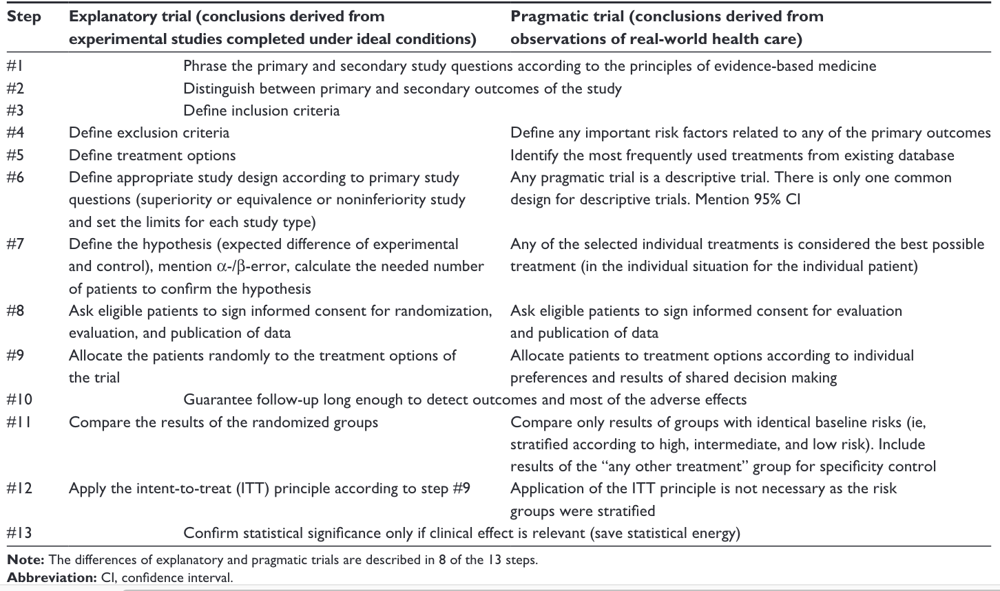

# Drawbacks of the two-arm RCT {#drawbacks}

```{r packages-13,echo=F,warning=F,message=F}
#library(knitr)
#library(kableExtra)

#options(kableExtra.html.bsTable = T)
```

`r knitr::include_graphics("images/logo_alone_new.png")`

**Learning objectives**: By the end of this chapter, you will be able to:

-   Explain the difference between treatment efficacy and treatment effectiveness

-   Consider whether the RCT approach is feasible for evaluating a specific intervention

It can be frustrating to be told that the RCT is the "gold standard" method for evaluating interventions, only to find it is impossible to implement in many settings. Consider, for instance, the case of electropalatography, a biofeedback intervention for speech sound disorders. @leniston2021 noted a number of barriers to evaluating its effectiveness through a standard RCT. The method requires expensive specialist equipment that is only available to a few speech-and-language therapists, and an individual artificial palate needs to be made for each client. The therapy is delivered over a series of sessions that can extend over several months, and requires a highly trained therapist. Thus it is simply not feasible to recruit dozens, let alone hundreds, of cases for a RCT. Masking of intervention condition is also not possible; both child and therapist know who is receiving intervention. Furthermore, children who would be eligible for this intervention are likely to be very varied, both in terms of their diagnosis and associated conditions, and in terms of the specific speech sounds that they have difficulty producing. In Chapter \@ref(crossover) and Chapter \@ref(Single), we describe alternative within-subject approaches to evaluation that can be used in this situation. Here, we elaborate further on the issues that are likely to be problematic when trying to apply RCT methods to interventions used by allied health professionals.

## Inefficiency: need for unfeasibly large samples

In clinical RCTs, sample sizes typically require hundreds or even thousands of individuals, depending on analysis method and anticipated effect size, to give statistical power of 80% or more. These types of trials are usually well-funded and have a multidisciplinary team of researchers to facilitate the trial, including expert clinicians, research nurses, statisticians, data managers, field interviewers, qualitative researchers, and data entry clerks.

Historically, intervention studies in allied health professions and clinical/educational psychology have often used relatively small samples, regardless of the effect size of interest. Many of these studies were underpowered, giving a high risk of false negative results - though because of flexible data analysis and p-hacking, false positives were also common. The change to using larger well-powered studies has been somewhat slower than medical drug trial literature, in part, perhaps, because the stakes are lower: people are less likely to die or become seriously ill if the wrong conclusions are drawn from a trial. For this reason, the requirements for study design outside medical fields have been less regulated.

Suppose, however, there was a requirement that no intervention study should be approved unless the statistical power was at least 80%. If we plan to analyse outcomes using a 1-tailed t-test, then with an effect size = 0.3 - a fairly typical effect size for an effective behavioural intervention - we would need 138 cases per group. Even if we had sufficient funds to cover the staff and research costs of a study this size, for many researchers in this field, it is not possible to recruit 276 clients for an intervention study.

We know that it is wasteful to run underpowered trials which have a strong likelihood of generating a type II error, so what can be done? One option, discussed in Chapter \@ref(power), is to move to a collaborative model of research where researchers pool their efforts to achieve the necessary sample size. But this is not the only way forward - and for the other reasons discussed in this chapter, it is not necessarily the optimal approach. We consider other options in chapters Chapter \@ref(crossover) and Chapter \@ref(Single).

## Transfer to real life: efficacy and effectiveness

A further issue that can hamper recruitment of an adequate sample size is the use of strict inclusion criteria - for instance, if we are studying intervention for developmental language disorder, we may wish to restrict participation to children who do not have additional conditions, such as attentional, social or motor impairments. This serves to minimize variability among the children in the study, and avoids cases where progress is affected by other problems interfering with the intervention effect. Similar issues often crop up in medical trials, where patients with comorbidities are excluded from trials that focus on treating a particular condition. In addition, trials are usually highly controlled to ensure that randomization and experimental conditions are consistent for each participant, but this may mean that interventions are administered in a way that deviates from routine clinical practice.

This is potentially a major drawback for RCTs - in the real world, "pure" cases without comorbidities are usually rare, and quite different from the typical caseload of a practitioner. In addition, inevitably, the only patients who are entered into trials are those who are willing to be randomized, so those who have a strong preference for one intervention will not be represented. Furthermore, in practice, a lack of flexibility in administration of the intervention may deter clinicians from referring their patients to a trial if it cannot accommodate individual differences among participants.

In the clinical RCT setting, the potential mismatch between "ideal" and "real-world" (or "in-practice") settings has been much discussed, with concerns expressed that an overwhelming focus on measures taken to ensure *internal validity* of trials, (i.e. factors such as randomization and masking to avoid biases), can compromise the *external validity* of trials - i.e. ability to generalize results from highly selected patient groups to clinical reality [@rothwell2005]. This has led to a distinction being drawn between explanatory trials (testing efficacy) or pragmatic trials (testing effectiveness). Typically in a clinical drug trial, the explanatory trial would be an earlier phase trial that tests for internal validity and the pragmatic trial would come later, using much larger samples of individuals and testing the external validity [@patsopoulos2011]. Singal and colleagues have summarized the notable differences between these trials [@singal2014]. Table \@ref(tab:diffeff), reproduced from [@singal2014], presents the key differences as summary points.

```{r diffeff,include=T,echo=FALSE,message=FALSE,warning=FALSE,tab.cap="Efficacy vs Efficiency trials",out.width="75%"}
library(tidyverse)
library(knitr)
library(kableExtra)

options(kableExtra.html.bsTable = T)

dt <- matrix(c('Question',	'Does the intervention work under ideal circumstances?',	'Does the intervention work in real-world practice?',
'Setting',	'Resource-intensive (ideal) setting',	'Real-world everyday clinical setting',
'Study population',	'Highly selected, homogenous population (Several exclusion criteria)', 'Heterogeneous population (Few to no exclusion criteria)',
'Providers',	'Highly experienced and trained', 'Representative usual providers',
'Intervention',	'Strictly enforced and standardized. No concurrent interventions',	'Applied with flexibility. Concurrent interventions and cross-over permitted'),ncol=3,byrow=TRUE)

dt <- as.data.frame(dt)
colnames(dt) <- c(' ','Efficacy/Explanatory study',	'Effectiveness/Pragmatic study')

knitr::kable(dt,escape = T, align = "c", booktabs = T, caption = 'Differences between efficacy and effectiveness studies') %>%
   kable_styling(c("striped", "bordered"), latex_options = "striped", full_width = F)

```

Explanatory trials (efficacy) are the most familiar trial design that is typically referred to in the RCT literature. They are designed to assess specific interventions in an idealized setting where most elements are carefully controlled and monitored. Randomization is used to ensure balance between control and intervention groups. In addition, inclusion and exclusion criteria are strictly adhered to prevent unnecessary confounding.

Pragmatic trials (effectiveness) are designed to assess interventions in a naturalistic setting which will be a far less controlled environment. In this type of trial, the intervention may differ slightly depending on the setting and patient requirement. This differs from an explanatory trial which will typically compare against a placebo condition. The pragmatic trial will also collect a range of measures that are more patient-focused rather than a biological or behavioural marker.

Figure \@ref(fig:porzsteps) is reproduced from @porzsolt2015, who described the 13 steps to assessing efficacy and effectiveness.

```{r porzsteps,echo=FALSE,message=FALSE,warning=FALSE,out.width="95%"}
  #read in table
```

When designing a trial of a behavioural intervention in allied health or education, the distinction between efficacy and effectiveness is highly pertinent, and researchers need to ask themselves whether the goal is to find out what the intervention can achieve under tightly-controlled, optimal circumstances, or whether it is to test its effectiveness in a more naturalistic setting. If the decision is made to focus on "pure" cases, this may allow a more tightly controlled efficacy trial, but then questions may be raised about the generalisability of results to the broader population.

Related to this point, it is worth noting a major reason for rejection of the term "Specific language impairment" to refer to children's developmental language problems was that it encouraged a focus on children with highly selective impairments in a single domain of development, when the clinical reality is that most children with language difficulties have additional problems that may variously affect attention, social interaction, academic attainment and/or motor skills [@bishop2017]. A trial that excluded all but "pure" cases of language impairment would not only be hard to recruit to; it would also lead to results that might be difficult to generalize to the kind of child that typically featured on a clinical caseload. In a similar vein, it is important on the one hand to ensure that an intervention is delivered in an optimal fashion, as its originators intended. But on the other hand, if results are going to be generalized to the broader community, we need to show that the intervention works even in non-ideal circumstances. For instance, where intervention is administered in schools, it may be unreasonable to expect teachers to adhere strictly to a rigid timetable, because the intervention has to be integrated so fit in around other activities.

## Heterogeneity and personalized intervention

In a RCT we assess the average effect of the intervention observed in a study sample. Generally, the traditional RCT is not able to provide information on treatment effectiveness for specific individuals. Indeed, if the RCT has been randomized correctly, then the identification of individuals in intervention and control groups is not possible without breaking the blinding. Hence, we can only discuss results in terms of average difference or effect size at the group level. Yet we know that people vary in their response to intervention, and for clinical purposes, we want to know whether this intervention is likely to work for this person.

To illustrate this point, consider Figure \@ref(fig:interventionhet), which shows data from a public dataset on body weight in chicks given either a regular diet (Control) or a new diet (Intervention). Average weight over time of intervention and control groups is shown as solid black and dotted lines respectively. Individual chicks are plotted as separate coloured lines (red for control and blue for intervention), showing the variation in both groups around those averages.

```{r interventionhet, echo=FALSE,message=FALSE,warning=FALSE,fig.cap="Data on body weight in chicks given a new diet (Intervention) or regular diet (Control). Average linear regression lines of intervention and controls group line is shown as solid black and dotted lines respectively.",out.width="75%"}
library(ggplot2)
library(forcats)
 
data(ChickWeight)
ChickWeight2 <- subset(ChickWeight, Diet == 1|Diet == 2)
ChickWeight2$Intervention <- ChickWeight2$Diet
#levels(ChickWeight2$Intervention)=c("Control","Intervention")
ChickWeight2<-ChickWeight2 %>% mutate(Intervention = fct_recode(Intervention, Control = "1", Intervention = "2"))

ChickWeight2$Outcome <-ChickWeight2$weight

reg1 <- lm(Outcome ~ Time, data = subset(ChickWeight2, Intervention == 'Control'))
reg2 <- lm(Outcome ~ Time, data = subset(ChickWeight2, Intervention == 'Intervention'))

predicted_df1 <- data.frame(Outcome = predict(reg1, subset(ChickWeight2, Intervention == 'Control')), Time=subset(ChickWeight2, Intervention == 'Control')$Time, Chick=subset(ChickWeight2, Intervention == 'Control')$Chick)
predicted_df2 <- data.frame(Outcome = predict(reg2, subset(ChickWeight2, Intervention == 'Intervention')), Time=subset(ChickWeight2, Intervention == 'Intervention')$Time,Chick=subset(ChickWeight2, Intervention == 'Intervention')$Chick)

ggplot(data=ChickWeight2,aes(x = Time, y = Outcome, group = Chick)) + geom_line(aes(colour=Intervention),alpha=0.5) +
    geom_point(aes(colour=Intervention),alpha=0.5) + theme_bw() + geom_line(data = predicted_df1, aes(x=Time, y=Outcome),linetype='dashed') + geom_line(data = predicted_df2, aes(x=Time, y=Outcome))


```

This is rather far-removed from interventions used with humans, but it makes a useful point. The chicks are very homogeneous in terms of their genetic background and the environmental conditions, but nevertheless, we see quite wide variation in outcomes from chick to chick. Measurement error (poor test reliability, see Chapter \@ref(reliability)) is unlikely to explain much variation: measures of weight won't be perfectly reliable, but the differences between chicks are pretty stable across the different measurement times. So, it is clear that the birds vary in their response to the diet. Indeed, the chick with lowest weight at the final time point is from the intervention group, and some control chicks do better than the average chick in the intervention group.

In clinical trials research, there is a growing shift in focus from average results to individual response to treatment - often referred to as **precision medicine**. This has been conspicuously successful in the field of cancer treatments [@garralda2019], where knowledge of a patient's genetics has made it possible to tailor drug treatments to the individual. Two developments have followed: (a) new methods of trial design, that are less rigid in their approach (see , e.g., Chapter \@ref(adaptive)); (b) an increased focus on biomarkers - individual differences in people's biological make-up that may be predictive of response to treatment.

It should be noted, however, that some people are sceptical about the value of biomarkers in contexts beyond oncology: precision medicine works best when there is a good understanding of the mechanism of a disease, and this is often lacking. Furthermore, if biomarkers are simply added to an analysis in the hope of finding something that predicts response to intervention, then there is a strong risk of false positive findings, unless stringent measures are taken to avoid such bias (see Chapter \@ref(phacking)). Simply dividing people into "treatment responders" and "nonresponders" and looking for differences between them leads to many statistical traps for the unwary [@senn2018]. Finally, the emphasis on biomarkers ignores social and environmental factors that may be important in intervention response for many diseases.

What does any of this have to do with the behavioural interventions used by allied health professionals? We should start by saying that we are dubious that the study of biomarkers will be of help in predicting response to intervention in individuals with speech and language disorders. There is a substantial research literature studying genetic and neurobiological bases of these conditions, but attempts to link this work to intervention have been plagued by methodological problems [@bishop2013a]. A much stronger argument can be made, however, that there are individual differences between people that are likely to affect how they respond to intervention, and hence we need to develop interventions that are tailored to the individual's speech, language and communication problems. Indeed, most speech and language therapists would argue that this is exactly what they aim to do. Insofar as this is the case, it follows that the traditional RCT has limited applicability to this field. This does not mean, however, that we should abandon attempts to evaluate interventions, and simply ignore potential sources of bias. Alternative approaches that are more compatible with a "precision" approach to speech and language therapy are covered in Chapter \@ref(Single).

## Check your understanding

Pick a RCT on a topic of interest to you from the literature - this can be the same as for previous exercises if you wish. Consider the question (modified from one asked by @treweek2009):\
"How likely is it that this treatment (apparently successful in this trial or review) will achieve important benefits in my context, administered by me to my patients?"
