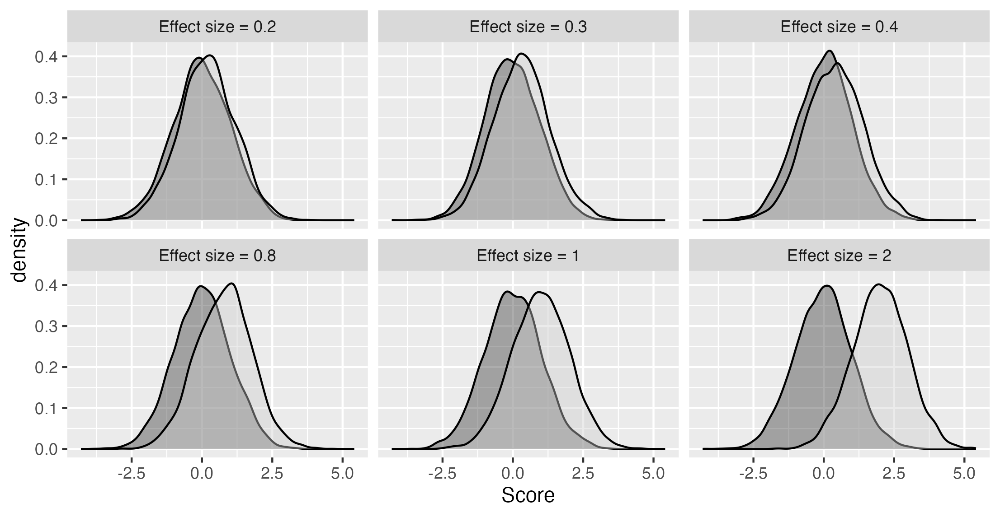
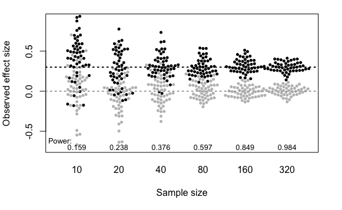
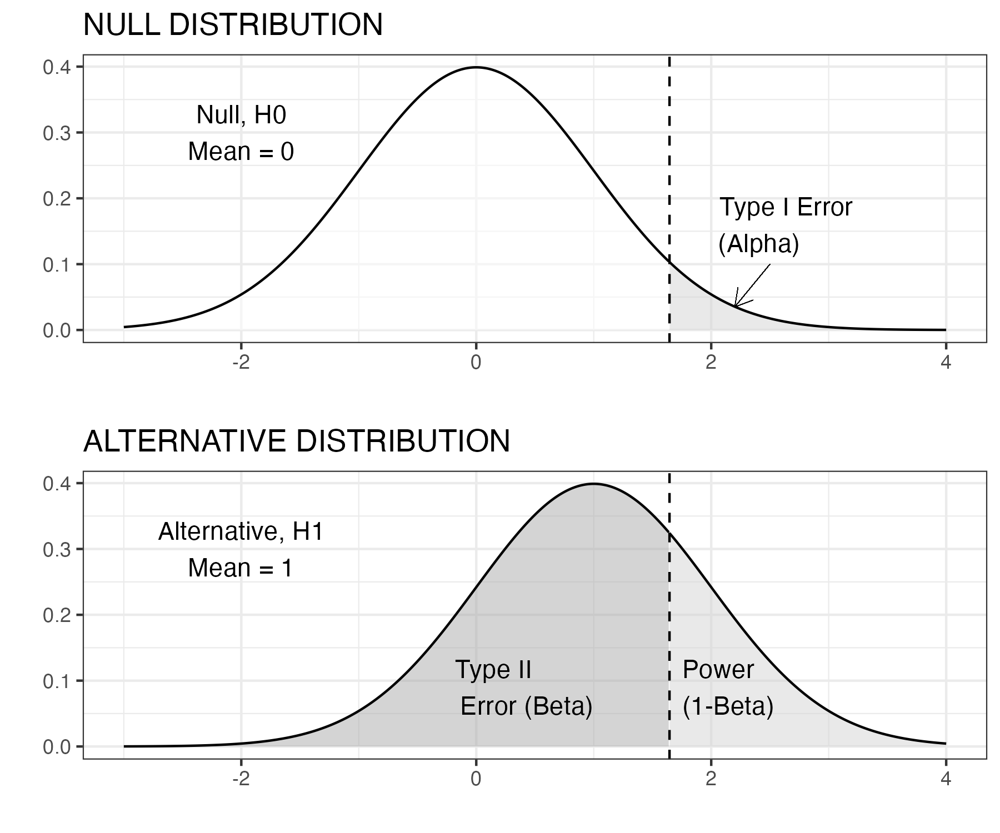
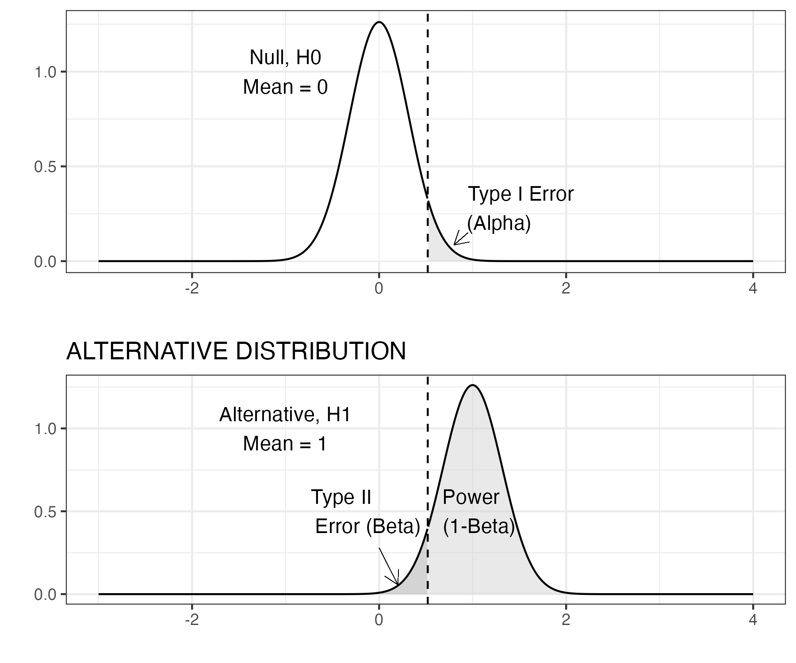
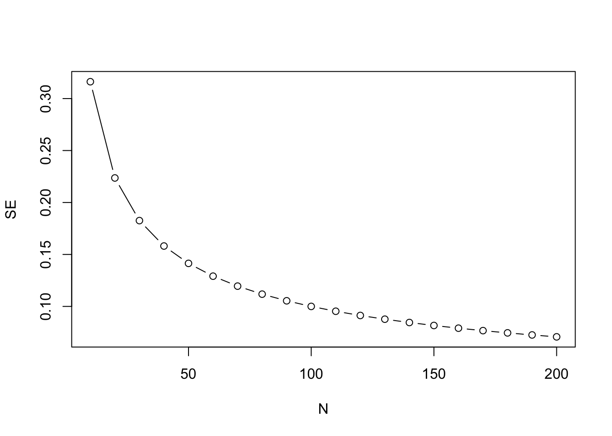

# How big a sample do I need? Sampling, statistical power and type II errors {#power}

```{r, echo=F,warning=F,message=F}

library(tidyverse)
library(kableExtra)
library(knitr)
library(MASS)
library(dplyr)
library(magrittr)
library(ggplot2)
library(ggpubr)
library(pwr)
library(beeswarm) #nice plotting package
library(doBy)
library(here)

```

```{r addlogo,echo=F,warning=F,message=F}
mylogo <- 0
if(mylogo==1){
knitr::include_graphics("images/logo_alone_new.png")
}
```

## Learning objectives  
By the end of this chapter, you will be able to:

-   Appreciate how studies with small samples may lead us to wrongly conclude an intervention is ineffective

-   Understand how effect size is measured and how it relates to statistical power

-   Explain what a type II error is, and how it may arise when sample size is too small


## Sampling

We start with further exploration of our fictitious diet comparison of Carbocut vs 3M. Suppose there are two people who tried Carbocut and lost an average of 4 lb over 2 weeks. Another two people tried Program 3M and lost an average of 1 lb over 2 weeks. Would that convince you that Carbocut is superior? What if we tell you that one person in the Carbocut group lost 6 lb and the other gained 2 lb; in the Program 3M group, one person lost 5 lb and one gained 3 lb. Few people would find this convincing evidence that Carbocut is superior. With only two people per group, the average is quite unstable and highly dependent on the specific people in the group. Things would look more convincing if you had 1000 people in each group, and still saw a 4 lb loss vs a 2 lb loss. Individual weights would fluctuate, but the average is a much better indication of what is typical when we have a larger sample, because individual people with extreme scores will have less impact.

How could we know the real truth of just how much weight loss is associated with each diet? In theory, there is a way we could find out - we could recruit every single person in the world who meets some selection criterion for inclusion in the study, and randomly assign them to one or the other diet, and then measure weight loss. Of course, in practice, that is neither possible nor ethical. Rather, the aim of research is to test a group of people whose results can be generalized to the broader population. So we recruit a **sample** which is intended to represent that much larger population. As the example above demonstrates, we need to think about sample size, as this will affect how much confidence we can place in the estimates from the sample. We know that two people is too small a sample. 1000 seems much better but, outside medical trials, is often too expensive and difficult to achieve. So how do we decide the optimal sample?\index{sample size}

## Effect size 
The *standardized effect size* \index{effect size} is a way of describing the difference between groups that takes into account the standard deviation. There are various ways of measuring this: a simple measure is **Cohen's *d***, which is the difference between groups measured in **standard deviation** units. Cohen's *d* is computed by dividing the mean difference between groups by the pooled standard deviation. \index{Cohen's d}For conditions A, B and C in Figure \@ref(fig:demo-variation), Cohen's *d* is .4, .8 and 1.5, respectively.

If we know what Cohen's *d* is, this gives us a sense of how much overlap there is between groups. Figure \@ref(fig:effsizefig) shows the relationship between Cohen's *d* and overlap between groups as density plots, \index{density plot}where the height of the distribution represents the frequency of individuals with that score: the larger the effect size, the less the overlap. It can be sobering to note that for most effective educational and therapeutic interventions, effect sizes are typically no more than .3 or .4. \index{effect size!overlap of distributions}Thus there is a lot of overlap, and in effect we have to pick out a meaningful signal - an intervention effect - from a very noisy background.

```{r effsizefig, echo=F,out.width="100%", fig.cap="Overlap in distributions of scores of two groups for different effect sizes (Cohen's d)"}
#made with script makeESdemodensitych10.R

```


## Sample size affects accuracy of estimates

Once we have an idea of the likely effect size in our study, we can estimate how big a sample we need. \index{sample size}If we have a small effect size, then we need many observations to get a reliable estimate of the true effect of intervention. Figure \@ref(fig:varES) resembles Figure \@ref(fig:effsizefig), but there is an important difference: in Figure \@ref(fig:varES), each blob represents the *observed mean* from a sample of a given size, taken from a population where the true effect size, shown as a dotted horizontal line, is 0.3.

```{r varES, echo=F,fig.cap="Simulated mean scores from samples of varying size, drawn from populations with either a null effect (grey) or a true effect size, Cohen's d, of .3 (black). Power (discussed below) is the probability of obtaining p < .05 on a one-tailed t-test comparing group means for each sample size (Based on Bishop et al, 2022)",out.width="100%"}


```

Notice how the observed means jump around from sample to sample when sample size is small, but become more stable once we have 80 or more participants per group. When there are 320 participants per group, the means are estimated pretty accurately and the dots bunch around the mean line for the group, but with 10 per group, it is very unreliable, and in some of our studies the mean of the black group is lower than the mean of the grey group, which is opposite to what is true in the population.


## Type II error

A Type II error\index{Type II error} is the same as a **false negative**. It is the error that occurs when the null hypothesis\index{null hypothesis} is not rejected but a true effect is actually present. In other words, the data lead us to conclude an intervention doesn't work when it really does have an effect.

Suppose a researcher wants to test a well-established and frequently-replicated result: children whose parents read to them more frequently obtain better results when they are tested on vocabulary. 20 families are split into two groups; in the first group, parents are encouraged to read with their child each night for 3 months, whereas in the other group no such encouragement is given. The study is run, but when children's vocabulary results are compared, the statistical test results in a p-value of .23, much greater than the $\alpha$ level of .05.

The researcher is confused as she knows there is research evidence to indicate that an effect should be present. There are, of course, a number of reasons why the experiment might have turned up a null result, but anyone familiar with statistics will think of the most likely explanation: unfortunately, she has failed to take into account the fact that the effect is fairly small, and to show it convincingly she would need a much larger sample size then 10 families per group.\index{null result}

## Statistical power and $\beta$

Statistical power is the probability that a study will show a significant difference on a statistical test when there is a true effect. Statisticians use the term $\beta$ to refer to the proportion of nonsignificant results that are false negatives (type II error); power is 1-$\beta$, expressed either as a proportion or a percentage.\index{beta!and power}

In practice, it can get confusing to think about Greek symbols (especially since $\beta$ has a completely different statistical meaning in the context of regression!) but the main point to grasp is that if I say my study has 40% power, that means that, if there were a true effect of intervention, and I were to run the study 10 times, on only four occasions would I obtain a statistically significant difference.

Power depends several factors including:\index{power!factors affecting}\index{power!beta}

-   Sample size
-   True effect size in the population
-   Criterion for statistical significance, also known as the Type 1 error rate ($\alpha$)\index{statistical significance!alpha}

As can be seen from Table \@ref(tab:powertable), in general, the larger the sample size, the higher the power, and the greater the effect size, the higher the power.\index{power!sample size} This is a sobering table for fields where it is not uncommon to have sample sizes of 20 or less per group, especially as we know that few effective interventions have effect sizes greater than .4.\index{sample size!power}

```{r powertable,echo=FALSE, message=FALSE,warnings=FALSE}

options(kableExtra.html.bsTable = T)
nlist<-c(10,20,30,40,50,80,100,150,200)
elist<-c(.1,.2,.3,.4,.5,.6,.8,1)
powerdf<-data.frame(matrix(NA,nrow=length(nlist),ncol=(1+length(elist))))
colnames(powerdf)<-c('N per group',elist)
powerdf[,1]<-nlist
thisrow<-0

for (myn in nlist){
  thisrow<-thisrow+1
  thiscol<-1
  for (mye in elist){
    thiscol<-thiscol+1
    powerdf[thisrow,thiscol]<-round(pwr.t.test(n=myn,d=mye,sig.level=.05,type='two.sample')$power,3)
    
  }
}
knitr::kable(powerdf,escape = F, align = "c", booktabs = T, caption = 'Power for 2-tailed independent t-test, alpha = .05') %>%
  kable_styling(c("striped", "bordered"), latex_options = "striped", full_width = F)  %>%
  add_header_above(c(" ","Effect size (d)" = 8))
```

We can also show how power is affected by changing the $\alpha$ level - this affects how large a difference we need to see between groups before we reject the null hypothesis. When $\alpha$ is more extreme, we will make fewer false positive errors (see Chapter \@ref(phacking)), but we will make more false negatives.\index{power!false negatives}

Figure \@ref(fig:densplot) illustrates this in a simple example using a z-test, which simply assesses how likely it is that a sample came from a population with a given mean. This is not a realistic example, but it is used to give more insight into power. Suppose we have some background information with sets of reading scores from children who did and did not have the intervention. We now have a single child's score on a reading test, and we want to know whether they had the reading intervention. Figure \@ref(fig:densplot) below shows the distribution of scores for children who had no intervention in the top: this is a density plot, showing how common different scores are (proportion of the population is on the y-axis), for each specific score on the x-axis. The shape follows a normal distribution: most scores are in the middle, with higher or lower scores being less common, and the mean is zero and standard deviation is one. The null hypothesis is that the child's score comes from this distribution.

\begin{center}
```{r densplot,echo=FALSE, message=FALSE, warning=FALSE, fig.cap="Z test: statistical power, N=1",out.width="75%"}
#https://stats.stackexchange.com/questions/14140/how-to-best-display-graphically-type-ii-beta-error-power-and-sample-size

#TeachingDemos package in R for inspiration.


```
\end{center}

The lower figure shows the distribution for children who had the reading intervention. The intervention had a large effect (Cohen's *d* of one), and so the whole distribution is shifted over to the right. We're going to use a one-tailed z-test,\index{one-tailed test} because we know that the child's score will either come from the null distribution, or from one with a higher mean. We decide to use the conventional level of $\alpha$ of .05. The vertical dotted line is therefore placed at a point where 5% of the upper distribution (the red area) is to the right of the line, and 95% (the white area) to the left. This point can be worked out from knowledge of the normal distribution\index{normal distribution} and corresponds to a score on the x-axis of 1.65. Our rule is that if the child's score is greater than 1.65, we reject the null hypothesis. If it is less than 1.65, we can't reject the null hypothesis. This does not mean that the child definitely came from the non-intervention group - just that the evidence is not sufficient to rule that out. Regardless of the effect size or the sample size, if $\alpha$ level is set to .05, we wrongly reject the null hypothesis on only 1 in 20 experiments.

But now look down to the lower distribution. False negatives are represented by the dark grey area to the left of the dotted line: cases where we fail to reject the null hypothesis, but the score really came from the group with intervention. The power of the study corresponds to the pale grey region, where we have a score greater than 1.65 and the data really come from the intervention condition. But notice that power is extremely low: the dark grey area is much bigger than the pale grey area. We are much more likely to wrongly retain the null hypothesis than to correctly reject it - even though we have a pretty large effect size. Note that whereas the false positive rate is kept constant by selection of $\alpha$ of .05, the false negative result is not.

If we wanted to make the false negative (type II error) rate much lower, we could adopt a less stringent $\alpha$ level, e.g. we could move the vertical dotted line to the point where the x-axis was zero, so the pale grey area becomes much bigger than the dark grey area. But if we do that, we then would increase the type I (false positive) error rate to 50%!


```{r densplot2,echo=FALSE, message=FALSE, warning=FALSE, fig.cap="Z test: statistical power, N=10",out.width="60%"}
#created with makealphabeta2.R

#TeachingDemos package in R for inspiration.

```


Our next figure \@ref(fig:densplot2) presents the same one-tailed z test but here the sample size has increased to 10. A key point is that the density plot here does *not* show the distribution of scores from individual children in any one sample; it is the distribution of *means* that we would see if we repeatedly took samples of a given size. So if we had a population of 10,000 children, and just kept taking samples of 10 children, each of those samples would have a mean,\index{mean!sampling distribution} and it is these that are plotted here. We should notice that two things have appeared to change. First, we see a greater distinction between the two distributions. Second, we see that the critical $z$ value (vertical dashed line) has changed location. The distributions have not changed their location (the peak of each bell shaped curve is the same), but the spread of each distribution has shrunk as a result of the increased sample size, because the precision of the estimate of the mean\index{mean!precision of estimate} improves with a larger sample.The shaded areas on the density plots directly relate to the concepts outlined above: power, type I, and type II errors. When the sample size increases, the standard error (SE) reduces. We notice that the type I error rate (area in red) is proportionally the same at 5%, but we see a change in the two remaining quantities, power and type II error rate. This is because these quantities are linked. The area under the density curve must always remain at 1, so proportionally, we can calculate the power as 1-$\beta$. We can visually see this in both figures by looking at the specified areas for the alternative distribution.

If you are finding this all quite confusing, don't worry. This is complicated and even those who have statistical training can find it challenging [@bishop2022a]. The most important points to take away from these examples are that:\
- Statistical power depends on the sample size and the effect size, as well as the level of $\alpha$\
- With small samples, studies often have low power, meaning that even if there is a real effect, there may be little chance of detecting it.\
- A p-value greater than .05 does not mean the null hypothesis is true.

It is therefore important to think about power when designing a study, or you may end up concluding an intervention is ineffective, when in fact it has a small effect that your study is underpowered to detect.


<!---#### Standard error of the mean {.unnumbered}
<p id="custom">-->
\begin{tcolorbox}[enhanced,breakable,colback=Black!5!lightgray,colframe=black!75!black,coltitle=white,title={Standard error of the mean}\label{box:SEM}
It can be challenging to get an intuitive understanding of power, because the computations needed to calculate it are not straightforward. A key statistic is the standard error of the mean, also known as the SEM, usually shortened to standard error (SE). This can be thought of as an index of the variability of an estimate of the mean from a sample. If you imagine taking numerous samples from a population, and estimating the mean from each one, you will end up with a distribution of means, similar to those shown in Figure \@ref(fig:varES). As shown in that Figure, these estimates of the mean are much more variable for small than for large samples. The SE is the standard deviation of the estimates of the mean, and it is crucially dependent on the sample size. This follows from the formula for the SE, which is computed as the SD divided by the square root of N.
The test statistic, *z* in this instance, which is used to derive a p-value, uses the SE as a denominator, and so will also be influenced by sample size. The *z* score is defined as:
z = (M - $\mu$)/SE
The bigger the N, the smaller the SE, the more precise the measurement, and the higher the power of the statistical test. Note that the value entered into these equations is the *square root* of N. It follows that improvement in precision from adding extra participants to a study is greatest at small sample sizes. As shown in Figure \@ref(fig:demoSE), the SE is approximately halved in increasing the sample size from 10 to 40, whereas changes are much smaller in going from 110 to 140 participants.
```{r demoSE, echo=F, include=T,out.width="75%", message=FALSE, warning=FALSE, fig.cap="Plot showing how SE reduces with sample size (N) in a nonlinear fashion"}
#figure created simply in base R
#myseq <- seq(10,200,10)
#plot(myseq,1/sqrt(myseq),type='b',ylab='SE',xlab='N')

```
\index{standard error of the mean (SEM)}

<!---</p>-->
\end{tcolorbox}  

Typically, clinical trials in medicine are designed to achieve 80% statistical power and, depending on the statistical analysis strategy, will employ some method to control type I error rate (traditionally $\alpha=0.05$). With $\alpha$ fixed, power depends on effect size and sample size.

So the first question is how do we select an effect size?\index{effect size!for power calculation}\index{power!how to select effect size} This is quite a thorny issue. In the past, it was common just to base anticipated effect sizes on those obtained in previous studies, but these can be overestimates because of publication bias (see Chapter \@ref(pubbias)). A more logical approach is to consider what is the smallest effect size that would be of interest: for instance, if you have a vocabulary intervention on which children start with a mean score of 20 words (SD of 10) would you be interested in an average improvement on an outcome test of half a word, or would you think the intervention would only be worthwhile if children improved on average by 4 or more words? @lakens2021 has a useful primer on how to justify a sample size.\index{sample size!justification}

Once a suitable effect size is established, then it is possible to compute power for different effect sizes, to work out how big a sample would be needed to attain the desired statistical power, typically set to 80% or more.

## Ways to improve statistical power

\index{power!how to improve}Researchers are often shocked when they first do a power analysis, to find that sample sizes that are conventionally used in their field are not adequately powered. Even more depressing, a power analysis may tell you that you would need an unfeasibly large sample in order to show an effect of interest. Researchers who start out planning a study with 20 individuals per group may be discouraged to find that they need 80 per group to do a meaningful study. This is a common predicament, but there are some ways forward:

-   If the necessary sample size is too large for you to achieve, it may be worth considering forming a consortium by joining forces with other researchers. Kate Button has advocated for the adoption of **team science** in psychology\index{team science}, recognising that many questions require larger samples than are typically available in any one centre [@button2020]. A particularly innovative step has been to encourage consortia for undergraduate research projects, which, she argues, not only allows for meaningful research to be done, but also provides much better training in research methods than the conventional set-up, where each student is supposed to do an original piece of research with limited resources [@button2018].\
-   People tend to think that the only way to increase power is by getting a larger sample size, but there are other options. You may be able to improve the effect size of your outcomes by careful consideration of reliability and sensitivity of the outcome measure. Remember, effect size is the difference in means divided by the standard deviation: if you can reduce the standard deviation by minimising random noise in your outcome measure, you will increase the effect size.\
-   In Chapter \@ref(phacking), we will consider how use of multiple outcome measures can be used to improve statistical power, provided measures are taken to avoid increasing false positives.\index{power!multiple outcomes}
-   It is worth consulting with a statistician about the optimal research design. A RCT with comparison of intervention and control groups is not the only possible approach. Some designs are more efficient than others for showing effects of interest: see especially Chapter \@ref(crossover) and Chapter \@ref(Single).\index{power!research design}

## Check your understanding
1. We have two studies of a spelling intervention, both using increased in number of words correct on a spelling test as the outcome measure. In both studies, two groups of 20 children were compared. In study A, the intervention group gained 10 words on average, with standard deviation of 2, and the control group gained 5 words, also with standard deviation of 2. In study B, the intervention group gained 15 words on average, with standard deviation of 5, and the control group gained 8 words with standard deviation of 5.  Which study provides stronger evidence of the effectiveness of the intervention?

2. The teaching of statistics is being transformed by the internet. There are some excellent interactive websites to help you gain a more intuitive sense of some of the statistical concepts in this chapter. For starters, we'd recommend [this website](https://www.zoology.ubc.ca/~whitlock/Kingfisher/SamplingNormal.htm) which focuses on sampling from a normally distributed population. You can vary the mean and standard deviation, as well as the sample size. The examples are from zoology, but the ideas apply much more broadly. This is just one of [several apps in a set: https://whitlockschluter.zoology.ubc.ca/stats-visualizations](https://whitlockschluter.zoology.ubc.ca/stats-visualizations) that is designed to help understand statistics.\index{interactive websites}

There are several online resources for calculating power for simple experimental designs. They vary in the level of statistical background that they require, but you should be able to use them to work out the required sample size for different scenarios. Have a look at these sites:  


[Power Calculator:https://egap.shinyapps.io/Power_Calculator/ ](https://egap.shinyapps.io/Power_Calculator/) Ignore the options of Clustered Design and Binary Dependent Variable for now. Also, note that when the Power Calculator asks you for the 'Treatment Effect Size' this is the *unstandardized* effect size, which is just the difference between means for Intervention and Control groups. If you specify that the standard deviation is 1, then you can get results for the standardized effect size, Cohen's *d*. Note that Power Calculator gives you the *total* number of participants. Be careful, because some power calculators give the number needed in each group.  


[Cohen's d: https://shiny.ieis.tue.nl/d_p_power/](https://shiny.ieis.tue.nl/d_p_power/)  

See whether for each site you can understand the graphics, and whether you can work out the answer for the following problems, each of which is just comparing an intervention group and a control group in a two-sided t-test:\
- You have an expected effect size of 0.3 and you want to work out the sample size to get power of .8 with $\alpha$ set to .05.\
- You can recruit 50 participants per group; you expect an effect size of 0.3. What is the power to detect this effect, with $\alpha$ set to .05?\
- What effect size would you be able to detect with 80% power and a sample size of 30 per group, with $\alpha$ set to .05?

More generally, it's well worth doing a web search for information if there are statistical terms or concepts you are struggling with. Sometimes the information you find is just confusing and too technical, but, as illustrated above, there are also excellent teaching resources out there.
