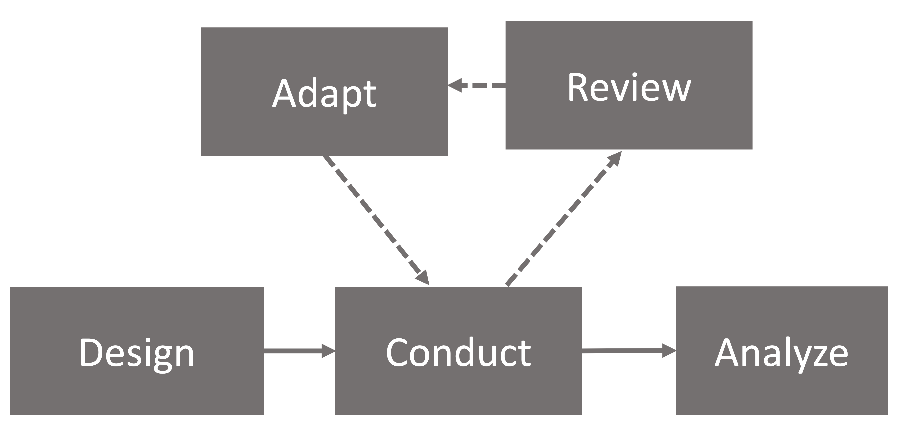
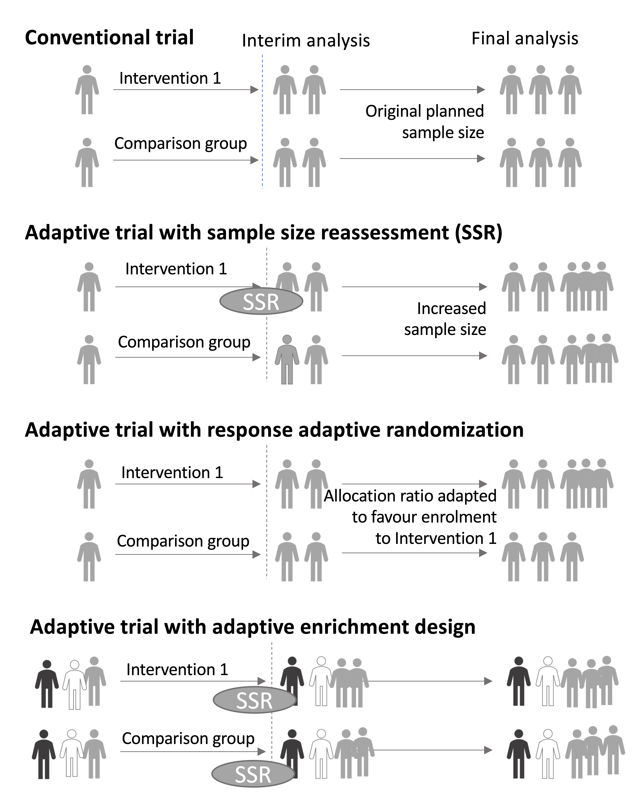

# Adaptive Designs {#adaptive}

```{r loadpackages, echo=F, message=F, warning=F}

library(tidyverse)
library(ggpubr)
library(ggalluvial)
library(diagram)

library(DiagrammeR)
library(DiagrammeRsvg)
library(magrittr)
library(rsvg)

library(kableExtra)
library(knitr)
library(citr)
```

```{r addlogo,echo=F,warning=F,message=F}
mylogo <- 0
if(mylogo==1){
knitr::include_graphics("images/logo_alone_new.png")
}
```

**Learning objectives**: By the end of this chapter, you will be able to:

-   Understand the characteristics of an adaptive design and recognise when it may be applicable

Suppose we have two potential school-based reading interventions for dyslexic children, one computer game that trains sight word recognition and one phonics-based. The lead researcher wishes to test both interventions but has limited funding, so can only run one trial rather than two independent trials. The researcher also has some idea that the phonics-based intervention is more likely to be effective. There is a substantial body of literature highlighting significant effect of the phonics intervention but in younger typically developing children, whereas the computer game intervention is novel and relatively untested.

A trial design is proposed that allows both interventions to be run in parallel with the addition of a control group for reference (who receive usual planned teaching); this is known as a three-arm trial (two interventions and a control). The researcher now has a further design decision to make, whether to use a traditional fixed design or an adaptive trial.

A traditional randomized control trial requires that data are not analyzed or "looked at" before data collection is completed. Sample size is calculated to ensure a well-powered study given certain assumptions about effect size of interest, type I error rate and power required. The analysis is performed after data collection is complete and results reported. In contrast, the adaptive trial method has the benefit that the intervention can be assessed at multiple points during the recruitment phase of the trial without biasing the results; hence we can make certain adjustments in light of this information.

Let's return to our three-arm trial for reading interventions. The researcher has started data collection and has gathered some initial teacher feedback that the novel computer game intervention seems to be hampering children's progress. In a traditional trial there would be no other course of action but to let the trial run its course and evaluate as planned. This might lead to the computer intervention showing poor results or even having a negative impact on those children, confirming the teacher's concerns. Alternatively, if the researcher had chosen an adaptive design the teacher's observations could have been assessed part way through the trial and the computer based intervention dropped from the study if interim analyses showed a negative impact of the intervention. As a consequence, the remaining individuals could change onto the phonics based intervention if the interim analyses showed positive results.


```{r adaptiveflow, fig.align="center", fig.height=8,echo=FALSE,out.width="50%",fig.cap="Flow diagram of adaptive trial"}

```


The adaptive design, as the name suggests, allows for modifications to certain aspects of the design as the trial progresses (see Figure \@ref(fig:adaptiveflow), based on @pallmann2018). Interim analyses are pre-planned and used to assess whether modifications are required. These assessments can be used to make several pre-specified changes, if required. Figure \@ref(fig:adaptivefig) [based on @thorlund2018] shows some of the commonly used adaptive trial designs. The Adaptive Trial with sample size reassessment has an interim step when sample size is re-evaluated based on provisional results. The trial with response adaptive randomization changes the allocation ratio to intervention and control groups depending on interim findings. The trial with adaptive enrichment changes the proportions of different participant types based on interim results. Other adaptive designs include: changing the amount or frequency of intervention received, and stopping intervention early if interim analysis shows the intervention to be ineffective or if adverse effects are observed.

```{r adaptivefig, echo=F, fig.align="center",out.width="90%",fig.cap="Commonly used adaptive designs; based on Thorlund et al, 2017"}


```
Adaptive designs can be more efficient than regular trials, as they allow ineffective interventions to be dropped early. They may also be more acceptable to participants, who will appreciate that they won't be required to continue with an unpromising intervention. However,  adaptive trials are not always preferable to regular trials. Before embarking on an adaptive trial, it is important to consider factors such as the time course of the study, the added complexity of planning an adaptive trial, and the possible dangers of stopping an intervention arm early on the basis of limited information. @wason2019 provides thoughtful discussion of this topic. 


## Check your understanding

1. A presentation by @ludlow2013 noted the potential of adaptive designs in speech and language therapy. She noted that most trials of swallowing therapies used a similar schedule, regardless of the type of therapy: in hospital, the patient was seen 1 hour a day for 10 days, giving a total exposure of 10 hours. Alternatively, some outpatient clinics would have patients coming in for one hour per week, for 2-4 weeks. Ludlow suggested that before embarking on a large and costly RCT it would make sense to do adaptive trials to find out what was the optimal schedule.\
Suppose you had access to 30 patients who were willing to participate in a clinical trial of swallowing therapy. You decide it's worth using an adaptive design to find out optimal conditions for treatment before embarking on a larger trial. You have the potential to vary the intensity of intervention (how many sessions per day or week), and the total number of sessions. Assuming you had the resources to try any combination of these, consider how you might proceed to home in on the optimal combination.


